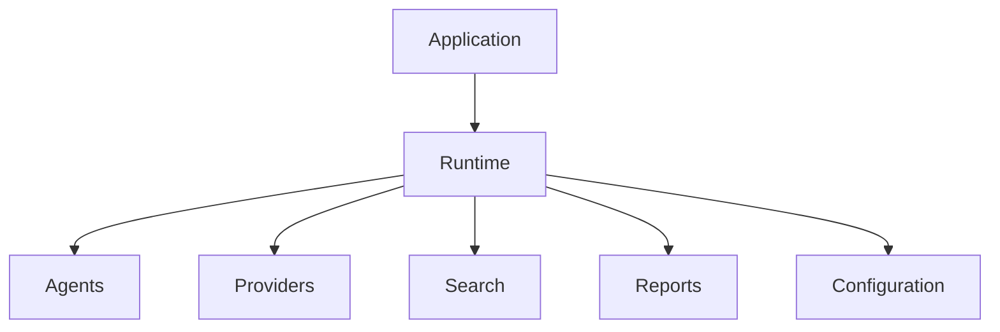
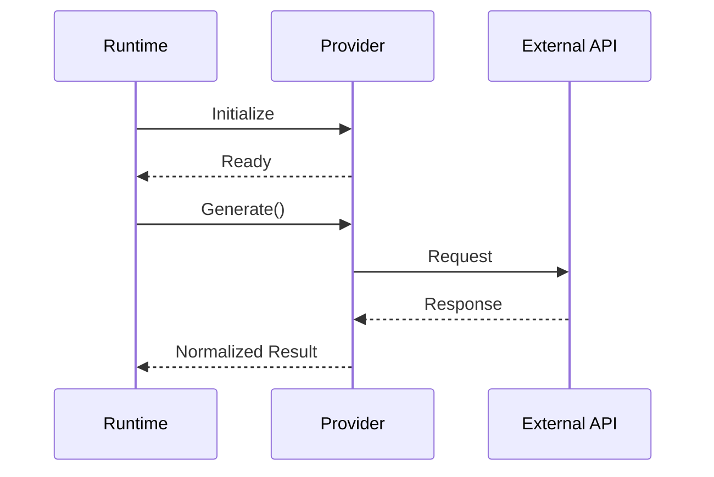

# API Reference

> **Developer Reference for AI Agent Lab Core Interfaces**

---

# Purpose

This document serves as the primary technical reference for the public interfaces exposed by AI Agent Lab.

It describes the responsibilities, contracts, expected behavior, and extension points of each major subsystem.

Unlike the architecture guide, which explains system design, this document focuses on the APIs that developers interact with when extending or integrating the project.

---

# Design Goals

The API surface has been designed to be:

- Stable
- Predictable
- Extensible
- Provider-agnostic
- Easy to test
- Well documented

Public interfaces should evolve carefully to minimize breaking changes.

---

# System Overview



The runtime coordinates all subsystem interactions while exposing a consistent execution model.

---

# Runtime API

The runtime acts as the orchestration layer for the application.

Primary responsibilities include:

- Initializing services
- Creating execution context
- Coordinating agents
- Invoking providers
- Managing search
- Generating reports
- Returning execution results

The runtime should expose a small, well-defined public interface while keeping internal implementation details private.

---

# Runtime Responsibilities

The runtime should:

- Validate configuration before execution
- Initialize dependencies
- Coordinate execution order
- Handle runtime failures
- Collect metrics
- Produce execution summaries

The runtime should not contain provider-specific or report-specific implementation logic.

---

# Provider Interface

Every provider implementation must satisfy a common interface.

Typical responsibilities include:

- Client initialization
- Authentication
- Request execution
- Response normalization
- Error translation

The runtime communicates only with this interface, never with provider SDKs directly.

---

# Provider Lifecycle



The lifecycle should remain consistent regardless of the selected provider.

---

# Agent Interface

Agents represent specialized execution stages within the workflow.

Typical responsibilities include:

- Planning
- Research
- Analysis
- Synthesis
- Validation (future)

Each agent should perform a single, well-defined task.

---

# Agent Contract

Every agent should:

- Accept structured input
- Produce structured output
- Avoid direct provider initialization
- Use shared execution context
- Report meaningful errors

Agents should remain independent of one another wherever possible.

---

# Search Interface

The search subsystem provides external information retrieval.

Responsibilities include:

- Query execution
- Source retrieval
- Result normalization
- Error handling
- Retry behavior

Search providers should expose a common interface that allows the runtime to switch implementations without changing orchestration logic.

---

# Report Generation Interface

The reporting subsystem converts execution results into user-facing artifacts.

Supported outputs currently include:

- Markdown
- PDF

Future implementations may add:

- HTML
- JSON
- DOCX

Report generation should remain independent of agent reasoning and provider integrations.

---

# Configuration API

The configuration subsystem provides centralized access to runtime settings.

Typical responsibilities include:

- Environment loading
- Validation
- Default values
- Provider selection
- Model selection
- Logging configuration

Configuration consumers should access settings through the configuration layer rather than environment variables directly.

---

# Public API Principles

All public interfaces should follow these principles:

- Keep interfaces minimal.
- Prefer explicit contracts.
- Avoid exposing implementation details.
- Preserve backward compatibility where practical.
- Document breaking changes before release.

Stable interfaces reduce maintenance effort and simplify future enhancements.
---

# Data Models

AI Agent Lab exchanges structured data between runtime components.

Rather than passing loosely structured objects, each subsystem should communicate using well-defined data models.

Typical shared models include:

- Execution Request
- Execution Context
- Search Result
- Provider Response
- Agent Output
- Report Metadata
- Execution Summary

Clearly defined models improve maintainability and simplify testing.

---

# Execution Request

The execution request represents the input received by the runtime.

Typical fields include:

| Field | Description |
|--------|-------------|
| Prompt | User request |
| Provider | Selected provider |
| Model | Selected model |
| Output Format | Requested report format |
| Options | Runtime execution options |

Future implementations may include additional metadata while maintaining backward compatibility.

---

# Execution Context

The execution context provides shared state during a single workflow.

Typical responsibilities include:

- Current request
- Runtime configuration
- Shared agent data
- Search results
- Provider metadata
- Execution metrics

Execution context should remain scoped to a single workflow and should not be reused across independent requests.

---

# Provider Response Model

Provider implementations should normalize responses before returning them to the runtime.

Typical fields include:

| Field | Description |
|--------|-------------|
| Content | Generated response text |
| Finish Reason | Completion status |
| Usage | Token usage (if available) |
| Metadata | Provider-specific metadata |
| Error | Normalized error information |

Normalization shields higher-level components from provider-specific response formats.

---

# Search Result Model

Search providers should return a consistent structure regardless of implementation.

Typical fields include:

- Query
- Retrieved sources
- Titles
- URLs
- Snippets
- Search duration

This common representation enables the runtime to support multiple search providers with minimal changes.

---

# Agent Output Model

Each agent should return structured results rather than raw text alone.

Example elements include:

- Summary
- Findings
- Recommendations
- Supporting evidence
- Confidence indicators (future)
- Metadata

Structured outputs simplify downstream synthesis and reporting.

---

# Report Metadata

Generated reports may include metadata describing the execution.

Typical fields include:

- Report title
- Generation timestamp
- Provider
- Model
- Runtime version
- Execution duration

Metadata improves traceability and reproducibility.

---

# Execution Summary

The runtime should produce a concise execution summary after workflow completion.

Typical fields include:

| Field | Description |
|--------|-------------|
| Status | Success or failure |
| Duration | Total execution time |
| Provider | Active provider |
| Model | Selected model |
| Output Files | Generated artifacts |
| Warnings | Recoverable issues |

Execution summaries provide developers with a high-level overview of runtime behavior.

---

# Error Model

Errors should be represented consistently across all subsystems.

A normalized error model should include:

- Error category
- Human-readable message
- Source component
- Severity
- Recoverability
- Optional diagnostic context

This common structure simplifies logging, reporting, and user feedback.

---

# Logging Interface

Runtime components should communicate with the logging subsystem through a common interface.

Logging responsibilities include:

- Recording lifecycle events
- Reporting warnings
- Capturing failures
- Measuring execution timing

Business logic should remain independent of logging implementation details.

---

# Extension Points

AI Agent Lab is designed to support future extensibility.

Primary extension points include:

- Providers
- Agents
- Search providers
- Report generators
- CLI commands
- Configuration sources

New functionality should integrate through these extension points rather than modifying core runtime behavior directly.

---

# Interface Versioning

Public interfaces should evolve cautiously.

Guidelines include:

- Preserve existing behavior where practical.
- Introduce additive changes before breaking changes.
- Deprecate interfaces gradually.
- Document compatibility expectations.

Versioning interfaces thoughtfully reduces disruption for contributors and downstream integrations.

---

# Developer Best Practices

When consuming public APIs:

- Depend on interfaces rather than implementations.
- Validate inputs before execution.
- Handle normalized errors consistently.
- Avoid provider-specific assumptions.
- Keep integrations loosely coupled.

Following these practices promotes maintainability and simplifies future evolution of the codebase.
---

# API Usage Examples

The following examples illustrate how runtime components should interact through public interfaces.

## Runtime Execution

```python
runtime = Runtime(settings)

result = runtime.execute(
    prompt="Summarize the latest AI trends."
)
```

The runtime manages initialization, orchestration, and report generation. Consumers should avoid invoking lower-level components directly unless required for testing or extension.

---

## Provider Example

```python
provider = GeminiProvider(settings)

response = provider.generate(prompt)
```

The provider implementation returns a normalized response that can be consumed consistently by the runtime.

---

## Search Example

```python
search = TavilySearch(settings)

results = search.search(
    query="Large Language Models"
)
```

Search implementations should return normalized search results regardless of the underlying service.

---

## Report Generation Example

```python
report = MarkdownReportGenerator()

report.generate(result)
```

Report generators consume structured execution results rather than interacting directly with providers or agents.

---

# API Usage Patterns

To maintain consistency across the project:

- Initialize shared dependencies once.
- Pass structured data between components.
- Prefer composition over inheritance.
- Keep public APIs minimal.
- Avoid exposing internal implementation details.

These patterns reduce coupling and improve maintainability.

---

# Testing Public Interfaces

Public interfaces should be tested independently of implementation details.

Recommended testing strategy:

## Unit Tests

Verify:

- Input validation
- Output structure
- Error handling
- Boundary conditions

---

## Integration Tests

Verify:

- Runtime orchestration
- Provider communication
- Search integration
- Report generation
- Configuration loading

---

## Contract Tests

Contract tests help ensure that implementations remain compatible with their interfaces.

Typical checks include:

- Required methods exist.
- Return values follow the documented structure.
- Error behavior is consistent.
- Configuration requirements are satisfied.

Contract testing is particularly valuable when supporting multiple providers.

---

# Backward Compatibility

Whenever practical, public interfaces should evolve without breaking existing integrations.

Recommended practices include:

- Add new fields rather than modifying existing ones.
- Deprecate obsolete interfaces gradually.
- Document compatibility expectations.
- Provide migration guidance for breaking changes.

Breaking changes should generally be reserved for major version releases.

---

# API Review Checklist

When introducing or modifying a public interface, verify:

## Design

- [ ] Responsibility is clearly defined.
- [ ] Interface is minimal.
- [ ] Naming is consistent.
- [ ] Dependencies are explicit.

---

## Usability

- [ ] Documentation updated.
- [ ] Examples provided.
- [ ] Error behavior documented.
- [ ] Defaults clearly defined.

---

## Reliability

- [ ] Input validation implemented.
- [ ] Errors normalized.
- [ ] Logging integrated.
- [ ] Tests added or updated.

---

## Maintainability

- [ ] No unnecessary coupling.
- [ ] Extension points preserved.
- [ ] Backward compatibility considered.
- [ ] Future evolution documented where appropriate.

---

# Related Documentation

For additional information, refer to:

| Document | Purpose |
|----------|---------|
| `ARCHITECTURE.md` | Overall system design |
| `CLI.md` | Command-line interface |
| `PROVIDERS.md` | Provider integrations |
| `OBSERVABILITY.md` | Logging and diagnostics |
| `CONTRIBUTING.md` | Development workflow |
| `ROADMAP.md` | Strategic direction |
| `CHANGELOG.md` | Release history |

---

# Maintaining This Document

Update this guide whenever changes affect:

- Public interfaces
- Data models
- Runtime contracts
- Provider contracts
- Search interfaces
- Report generation APIs
- Configuration APIs
- Extension points

Maintaining accurate API documentation reduces onboarding time and minimizes integration errors.

---

# Conclusion

The API surface of AI Agent Lab is intentionally small, stable, and extensible.

By defining clear contracts between the runtime, providers, agents, search subsystem, reporting, and configuration, the project enables contributors to extend functionality without introducing unnecessary coupling.

As the platform evolves, this document should remain the authoritative reference for public interfaces and their expected behavior.

---

**Document Version:** v0.7.1

**Last Updated:** July 2026

**Status:** Active