# System Architecture

> **A Technical Overview of AI Agent Lab**

---

# Purpose

This document describes the architecture of AI Agent Lab, the rationale behind key design decisions, and the interaction between the major runtime components.

Unlike the project README, which provides a high-level overview, this document focuses on implementation architecture, execution flow, extensibility, and engineering trade-offs.

It is intended for contributors, maintainers, and engineers who want to understand or extend the system.

---

# Architecture Goals

The architecture is designed around six primary objectives.

## 1. Modularity

Each component should have a single responsibility.

Components should be independently testable, maintainable, and replaceable.

---

## 2. Extensibility

New providers, agents, report generators, and search engines should integrate without requiring architectural changes.

---

## 3. Provider Independence

Business logic should remain completely independent of LLM providers.

Changing providers should require configuration rather than code modification.

---

## 4. Observability

Every significant runtime event should be visible through structured logging and diagnostics.

Developers should understand how the system reached its output.

---

## 5. Maintainability

Complexity should remain localized.

Individual modules should evolve independently while preserving stable interfaces.

---

## 6. Production Readiness

The architecture should support future requirements such as:

- parallel execution
- plugin systems
- REST APIs
- distributed execution
- enterprise deployment

without requiring major redesign.

---

# High-Level System Architecture

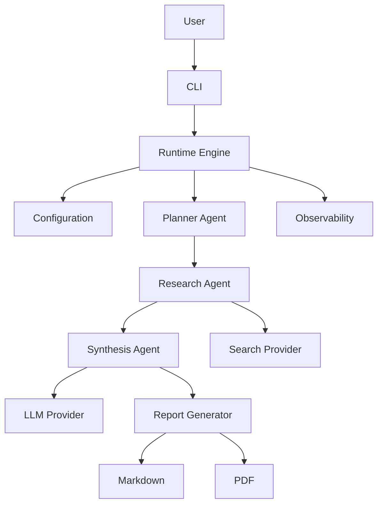

The runtime coordinates execution while individual components focus on specialized responsibilities.

---

# Architectural Layers

The system is organized into distinct layers.

```text
Presentation Layer

↓

Runtime Layer

↓

Orchestration Layer

↓

Agent Layer

↓

Provider Layer

↓

Infrastructure Layer
```

Each layer depends only on the layer immediately below it.

This layered approach minimizes coupling and improves maintainability.

---

# Layer Responsibilities

## Presentation Layer

Responsible for user interaction.

Includes:

- Command-line interface
- Runtime status display
- Progress reporting
- User input
- Output presentation

This layer should never contain business logic.

---

## Runtime Layer

Responsible for application lifecycle management.

Responsibilities include:

- Startup
- Shutdown
- Configuration loading
- Dependency initialization
- Runtime context creation
- Error recovery

The runtime acts as the central coordinator for application execution.

---

## Orchestration Layer

Coordinates agent execution.

Responsibilities include:

- Workflow sequencing
- Agent coordination
- Context propagation
- Result aggregation
- Execution monitoring

This layer defines *how* work flows through the system without performing the work itself.

---

## Agent Layer

Implements the core business logic.

Current agents include:

- Planner
- Research
- Synthesis

Future agents may include:

- Reviewer
- Validator
- Memory
- Critic
- Optimizer
- Evaluation

Each agent performs a focused task and communicates through structured data rather than provider-specific responses.

---

## Provider Layer

Abstracts interactions with external AI services.

Current providers:

- Gemini
- OpenRouter
- Groq

Future providers:

- Claude
- OpenAI
- Local LLMs

The provider layer ensures that upper layers remain independent of vendor-specific APIs.

---

## Infrastructure Layer

Provides shared services used throughout the runtime.

Examples include:

- Logging
- Configuration
- File system
- Report generation
- Search integration
- Utilities

Infrastructure components should remain generic and reusable across projects.

---

# Guiding Architectural Principles

The architecture follows several guiding principles:

- Composition over inheritance
- Interfaces over implementations
- Configuration over hardcoding
- Small focused modules
- Explicit dependencies
- Clear execution flow
- Documentation-driven development

These principles influence every architectural decision throughout the project.
---

# Runtime Bootstrap

Every execution begins with a deterministic bootstrap sequence that prepares the runtime before any AI agents are invoked.

The bootstrap process is responsible for validating configuration, initializing dependencies, and establishing a consistent execution context.

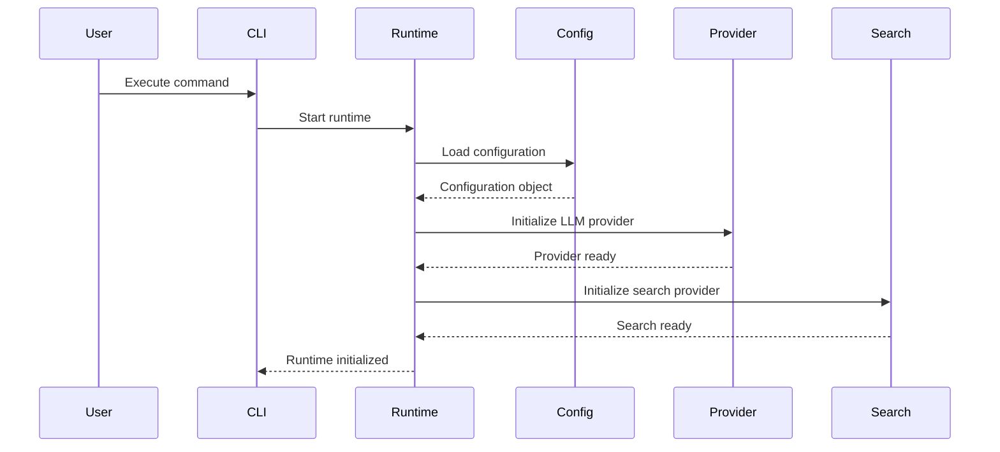

The bootstrap sequence is intentionally linear to simplify diagnostics and ensure failures are detected before expensive operations begin.

---

# Request Lifecycle

Once the runtime has been initialized, user requests follow a predictable execution lifecycle.

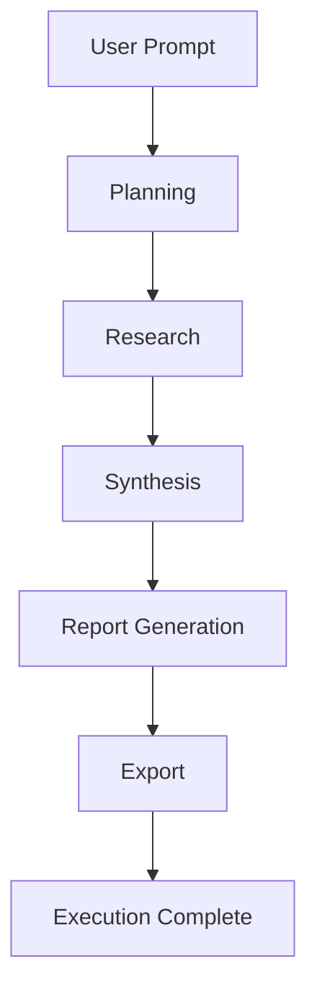

Each stage produces structured output that becomes the input to the following stage.

This explicit pipeline makes execution easier to understand, debug, and extend.

---

# Execution Context

The runtime maintains an execution context that persists throughout a single request.

Typical information stored in the execution context includes:

- User prompt
- Runtime configuration
- Selected provider
- Selected model
- Search provider
- Intermediate agent outputs
- Execution timestamps
- Runtime metrics
- Generated report paths
- Execution status

The execution context acts as the shared state passed between orchestration components while avoiding unnecessary global state.

---

# Component Dependency Graph

The project intentionally follows a layered dependency model.

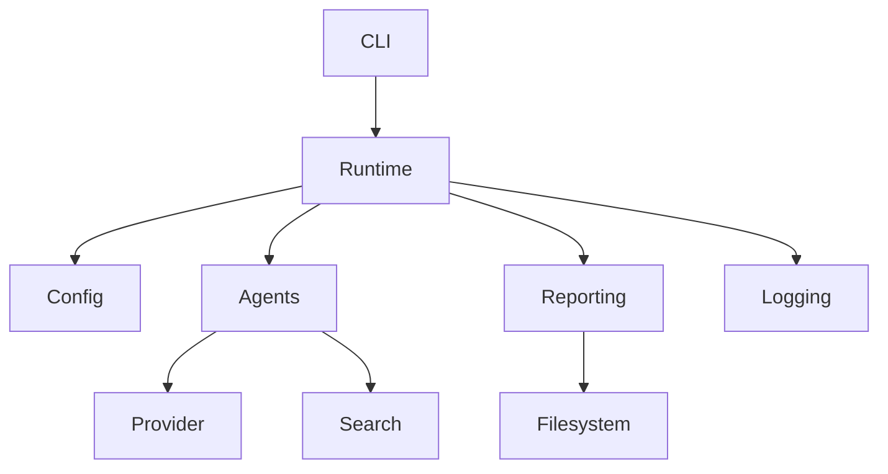

Notice that:

- Providers do not depend on agents.
- Reporting does not depend on providers.
- Logging remains independent of business logic.
- Configuration has no knowledge of runtime behavior.

This direction of dependencies minimizes coupling and simplifies future refactoring.

---

# Runtime Responsibilities

The runtime coordinates execution but intentionally avoids business-specific logic.

Primary responsibilities include:

- Loading configuration
- Initializing services
- Creating execution context
- Coordinating agent execution
- Managing failures
- Triggering report generation
- Collecting runtime metrics
- Producing execution summaries

Business reasoning belongs exclusively within the agent layer.

---

# Agent Collaboration

AI Agent Lab follows a cooperative multi-agent architecture.

Each agent performs one specialized task before handing structured output to the next stage.


Current execution is sequential.

The architecture intentionally allows future evolution toward:

- Parallel execution
- Conditional execution
- Dynamic routing
- Retry strategies
- Agent voting
- Human approval workflows

without requiring major architectural changes.

---

# Planner Agent

The Planner Agent is responsible for understanding the user's request before any external operations occur.

Typical responsibilities include:

- Determining user intent
- Breaking complex requests into logical tasks
- Identifying information gaps
- Producing a structured execution plan

The planner should avoid generating the final response directly.

Instead, it prepares downstream agents for efficient execution.

---

# Research Agent

The Research Agent enriches the execution plan using external information when required.

Responsibilities include:

- Generating search queries
- Collecting relevant sources
- Filtering noisy information
- Organizing findings
- Passing structured research to downstream agents

Search providers remain implementation details hidden behind a common abstraction.

---

# Synthesis Agent

The Synthesis Agent combines planning and research into a coherent response.

Responsibilities include:

- Integrating findings
- Eliminating redundancy
- Maintaining logical flow
- Producing structured output
- Preparing content for reporting

The Synthesis Agent represents the primary reasoning stage of the execution pipeline while remaining independent of presentation concerns.

---

# Architectural Trade-offs

Several deliberate trade-offs influence the current implementation.

| Decision | Benefit | Trade-off |
|----------|---------|-----------|
| Sequential execution | Simpler debugging | Lower throughput |
| Provider abstraction | Flexibility | Additional abstraction layer |
| Modular agents | Easier extension | More components |
| Configuration-driven runtime | Portability | More startup validation |
| Separate reporting layer | Multiple output formats | Additional processing stage |

These decisions prioritize long-term maintainability over short-term implementation simplicity.
---

# Provider Architecture

One of the core architectural goals of AI Agent Lab is complete separation between business logic and LLM implementations.

Rather than allowing agents to interact directly with vendor SDKs, all communication passes through a provider abstraction layer.

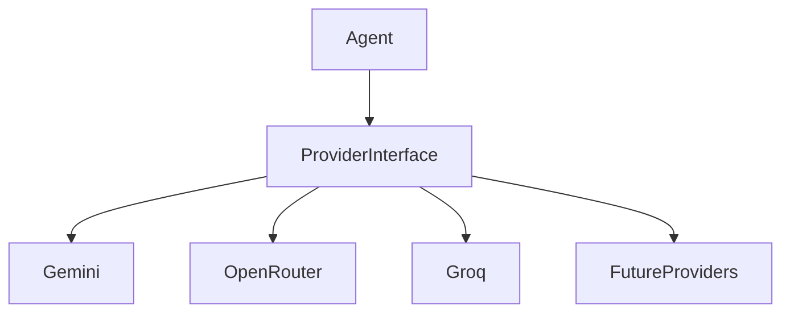

This architecture provides several advantages:

- Provider independence
- Simplified testing
- Cleaner business logic
- Easier experimentation
- Reduced vendor lock-in

Agent implementations remain completely unaware of the underlying provider.

---

# Provider Responsibilities

Every provider implementation should expose a consistent interface regardless of the underlying API.

Typical responsibilities include:

- Authentication
- Request formatting
- Response normalization
- Error translation
- Retry handling
- Timeout management
- Usage metrics collection

The provider layer should never contain business-specific reasoning.

---

# Provider Lifecycle

Each execution initializes exactly one active provider.

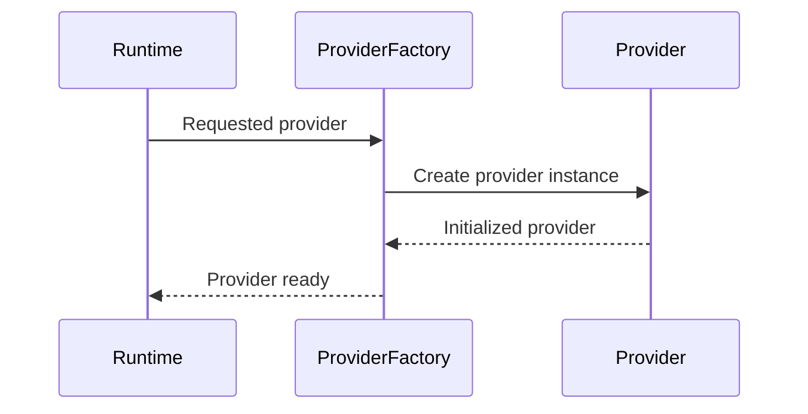

Provider selection is determined by runtime configuration rather than application logic.

---

# Search Architecture

External knowledge retrieval is isolated from the agent implementation through a dedicated search abstraction.

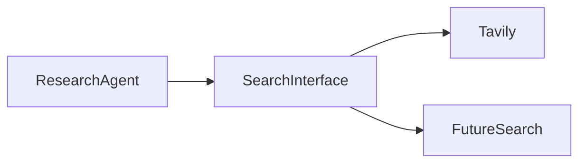

This design enables future search providers to be introduced without modifying the Research Agent.

---

# Search Responsibilities

The search subsystem is responsible for:

- Executing external searches
- Normalizing search results
- Handling provider-specific APIs
- Returning structured data
- Reporting search failures

Search providers should avoid performing reasoning.

Their responsibility ends with information retrieval.

---

# Reporting Architecture

The reporting subsystem converts structured execution output into user-facing artifacts.

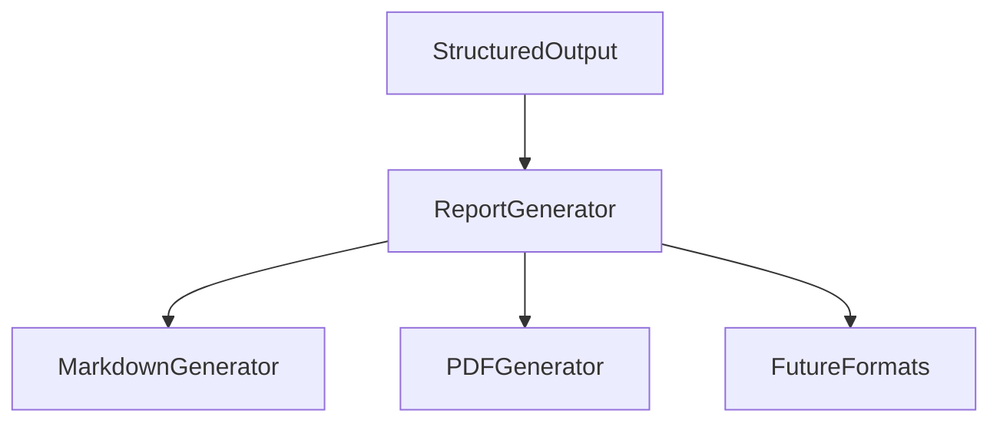

Separating reporting from reasoning enables new output formats without affecting the execution pipeline.

---

# Report Generation Pipeline

Report generation follows a simple sequence:

```text
Agent Output

↓

Normalize Structure

↓

Generate Markdown

↓

Generate PDF

↓

Write Files

↓

Return Paths
```

Future enhancements may introduce:

- HTML export
- DOCX generation
- Presentation generation
- JSON serialization
- Interactive dashboards

---

# Configuration Architecture

Configuration is centralized within a dedicated module.

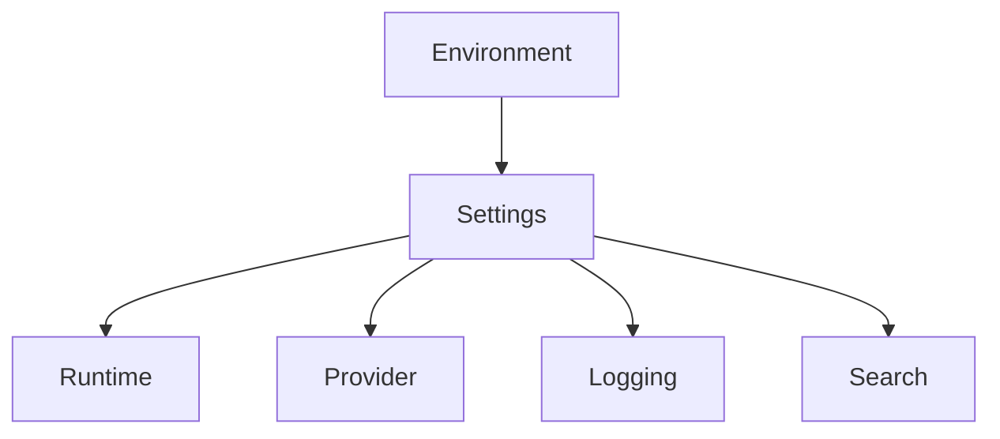

Configuration objects should remain immutable during execution whenever practical.

This improves predictability and reduces runtime side effects.

---

# Configuration Principles

The configuration system follows several principles.

## Explicit

Configuration values should never be hidden or inferred when avoidable.

---

## Environment Driven

Secrets should be supplied through environment variables rather than source code.

---

## Centralized

Configuration should exist in one location rather than being distributed across modules.

---

## Validated

Configuration should be validated during startup before execution begins.

Failing fast simplifies troubleshooting.

---

# Logging Architecture

Logging is treated as infrastructure rather than an implementation detail.

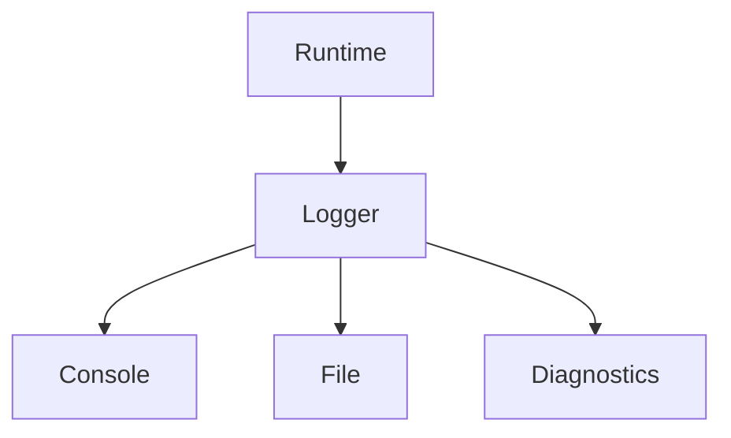

Every major subsystem reports through the same logging infrastructure.

This provides a consistent developer experience while simplifying troubleshooting.

---

# Logging Principles

Logging should be:

- Structured
- Human-readable
- Consistent
- Configurable
- Secure

Sensitive information must never be written to logs.

Examples include:

- API keys
- Authentication tokens
- Personal information
- Provider secrets

Masking should occur before any value reaches the logging system.

---

# Error Handling Strategy

Errors are classified according to their origin.

| Category | Examples |
|----------|----------|
| Configuration | Missing API keys, invalid settings |
| Provider | Authentication failures, rate limits |
| Search | Connectivity issues, search failures |
| Runtime | Initialization failures |
| Reporting | File generation errors |
| Unexpected | Unhandled exceptions |

Each category should provide meaningful diagnostics while preserving application stability whenever possible.

---

# Failure Recovery

Whenever practical, recoverable failures should not terminate execution immediately.

Examples include:

- Temporary search failures
- Non-critical report generation issues
- Optional provider features

Critical failures—such as invalid configuration or provider initialization failures—should stop execution early with clear error messages.

This "fail fast, recover where reasonable" approach improves reliability while maintaining a predictable execution model.
---

# Extension Points

A primary architectural objective of AI Agent Lab is extensibility.

New capabilities should integrate into the existing runtime with minimal changes to existing components.

Rather than modifying the orchestration pipeline for every enhancement, the architecture provides clearly defined extension points.

Current extension areas include:

- LLM providers
- Search providers
- Agents
- Report generators
- CLI commands
- Output formats
- Runtime hooks

Future releases may expose these as formal plugin interfaces.

---

# Extension Architecture

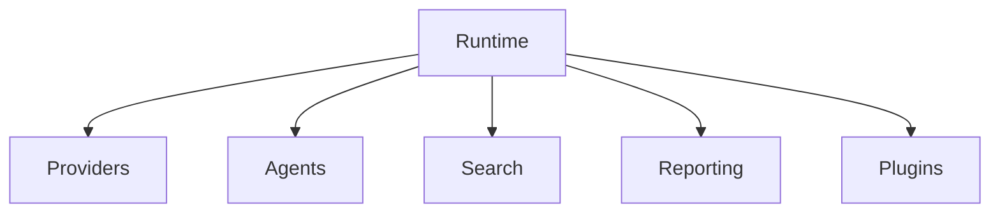

Every extension should communicate through stable interfaces rather than implementation-specific behavior.

---

# Plugin Architecture (Future)

The long-term vision includes a lightweight plugin framework.

```text
plugins/

├── provider_plugins/
├── search_plugins/
├── report_plugins/
├── agent_plugins/
└── runtime_plugins/
```

Each plugin would expose a registration interface that allows the runtime to discover and initialize it automatically.

Potential plugin use cases include:

- Additional LLM providers
- Enterprise search integrations
- Custom report templates
- Domain-specific agents
- Workflow automation

---

# Agent Evolution

The current runtime uses three primary agents.

```text
Planner

↓

Research

↓

Synthesis
```

Future versions may expand this pipeline into a richer collaborative workflow.


Each new agent should remain independently testable and communicate using structured data.

---

# Dynamic Agent Routing

Current execution follows a static sequence.

Future implementations may support dynamic routing based on request complexity.

```text
Simple Question

↓

Planner

↓

Synthesis

↓

Done
```

```text
Complex Research Request

↓

Planner

↓

Research

↓

Critic

↓

Validator

↓

Reviewer

↓

Reporting
```

Dynamic routing enables efficient execution without increasing complexity for simpler requests.

---

# State Management

Execution state is maintained through a shared execution context.

The context stores information such as:

- User prompt
- Runtime configuration
- Active provider
- Selected model
- Search results
- Intermediate outputs
- Runtime metrics
- Generated reports
- Execution status

The execution context should remain scoped to a single request.

Persistent application state is intentionally avoided in the current architecture.

---

# Future Memory Architecture

Persistent memory is planned as an optional subsystem.

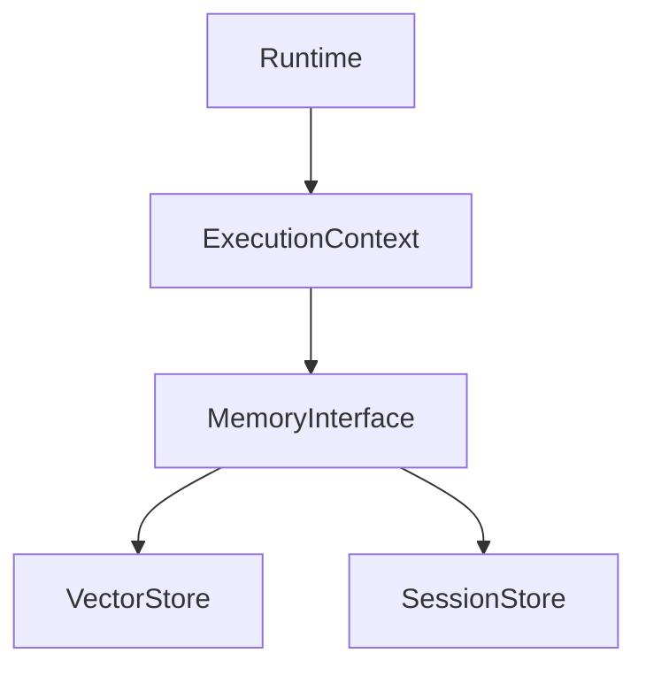

Potential capabilities include:

- Long-running conversations
- User preferences
- Semantic retrieval
- Historical execution context
- Conversation summarization

The memory subsystem will remain optional and should not impact stateless execution.

---

# Scalability Considerations

The architecture has been designed to support future scaling without major redesign.

Potential scalability improvements include:

## Parallel Agent Execution

Independent tasks executed concurrently.

Benefits:

- Reduced latency
- Better resource utilization
- Improved throughput

---

## Distributed Execution

Separate runtime components deployed independently.

Examples:

- Search service
- Report generation service
- Agent workers
- Provider gateway

---

## Streaming Responses

Instead of waiting for full completion, future versions may stream intermediate results.

Potential streaming stages include:

- Planning
- Research progress
- Partial synthesis
- Report generation

---

# Testing Architecture

Testing follows the same layered philosophy as the application itself.

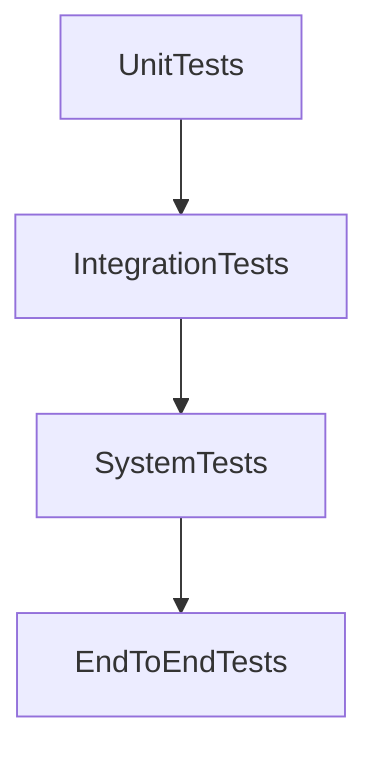

---

## Unit Testing

Validates individual components.

Examples:

- Provider implementations
- Configuration loading
- Utility functions
- Report generators

---

## Integration Testing

Validates interactions between components.

Examples:

- Runtime + Provider
- Runtime + Search
- Agent pipeline
- Reporting workflow

---

## End-to-End Testing

Validates complete execution from user prompt to generated report.

Example workflow:

```text
Prompt

↓

Planner

↓

Research

↓

Synthesis

↓

Markdown

↓

PDF

↓

Validation
```

---

# Security Architecture

Security considerations influence every layer of the runtime.

Current principles include:

- Environment-based secrets
- API key masking
- Fail-fast validation
- Structured error handling
- Minimal privilege
- No embedded credentials

Future enhancements may introduce:

- Secret managers
- Credential rotation
- Access control
- Audit trails
- Encrypted configuration

---

# Architecture Decision Records (ADR)

Major architectural decisions should be documented as Architecture Decision Records.

Proposed structure:

```text
architecture/

└── decisions/

    ADR-001-provider-abstraction.md

    ADR-002-multi-agent-pipeline.md

    ADR-003-report-generation.md

    ADR-004-search-abstraction.md

    ADR-005-runtime-bootstrap.md
```

Each ADR should include:

- Context
- Problem statement
- Decision
- Alternatives considered
- Consequences
- Future implications

Recording architectural decisions improves long-term maintainability and provides valuable historical context for future contributors.
---

# Performance Architecture

Performance optimization is approached as an architectural concern rather than an isolated implementation task.

The current implementation prioritizes simplicity and correctness while establishing a foundation for future optimizations.

Current optimization goals include:

- Minimal runtime startup overhead
- Efficient configuration loading
- Lightweight provider initialization
- Predictable execution flow
- Reduced unnecessary API calls

As the project matures, performance enhancements should remain transparent to higher-level components.

---

# Future Performance Improvements

Several architectural enhancements are planned to improve throughput and responsiveness.

## Parallel Agent Execution

Current workflow:

```text
Planner

↓

Research

↓

Synthesis
```

Future workflow:

```text
          Planner
          /     \
         /       \
 Research       Memory
      \           /
       \         /
      Synthesis
           │
           ▼
      Report Generation
```

Independent tasks can execute concurrently, reducing total execution time while preserving logical dependencies.

---

## Response Streaming

Rather than waiting for complete execution, future versions may stream progress incrementally.

Potential streamed events include:

- Runtime initialization
- Planning progress
- Search completion
- Agent completion
- Partial synthesis
- Report generation
- Export status

Streaming improves perceived responsiveness without altering the underlying execution model.

---

## Intelligent Caching

Future implementations may cache:

- Search responses
- Provider metadata
- Prompt templates
- Generated reports
- Configuration validation
- Frequently requested resources

Caching should remain transparent and configurable.

---

# Observability Architecture

Observability enables developers to understand system behavior without inspecting internal implementation details.

The observability layer focuses on answering questions such as:

- What happened?
- When did it happen?
- Which component executed?
- How long did it take?
- Which provider was used?
- What failed?
- Why did it fail?

---

# Observability Model

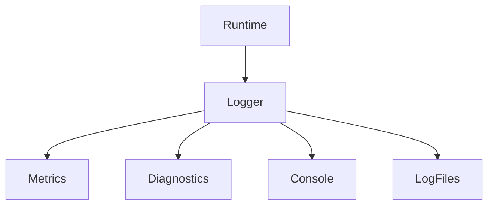

Observability components remain independent of business logic.

---

# Runtime Metrics

Future metrics may include:

| Metric | Description |
|---------|-------------|
| Execution Time | Total request duration |
| Provider Latency | Model response time |
| Search Latency | External search duration |
| Tokens Used | Provider token consumption |
| Reports Generated | Output statistics |
| Errors | Failure counts |
| Retries | Retry attempts |

Metrics should support both operational monitoring and performance optimization.

---

# Deployment Architecture

The current deployment target is a local development environment.

Future deployment models may include:

```text
Local Development

↓

Docker

↓

REST API

↓

Cloud Deployment

↓

Distributed Runtime
```

The architecture intentionally separates deployment concerns from runtime logic.

---

# Deployment Principles

Deployment should be:

- Reproducible
- Configuration-driven
- Environment independent
- Observable
- Easy to automate

Future deployment artifacts may include:

- Docker images
- Docker Compose
- Kubernetes manifests
- CI/CD pipelines
- Infrastructure as Code

---

# Repository Organization

The repository is intentionally structured around engineering responsibilities rather than technical frameworks.

```text
Workspace

↓

Projects

↓

Implementation

↓

Tests

↓

Documentation
```

This organization improves discoverability and allows multiple projects to share common engineering standards.

---

# Design Patterns

AI Agent Lab intentionally incorporates several established software design patterns.

## Factory Pattern

Used for provider initialization.

Benefits:

- Simplifies provider creation
- Encapsulates construction logic
- Improves extensibility

---

## Strategy Pattern

Used for provider abstraction.

Benefits:

- Runtime provider selection
- Reduced coupling
- Easier testing

---

## Pipeline Pattern

Used throughout the agent workflow.

Benefits:

- Predictable execution
- Clear responsibilities
- Simple debugging

---

## Adapter Pattern

Used to normalize external provider APIs.

Benefits:

- Consistent interfaces
- Easier provider replacement
- Reduced vendor-specific code

---

## Dependency Injection (Future)

Planned to simplify:

- Testing
- Runtime configuration
- Plugin loading
- Component replacement

---

## Dependency Map

User Request
      │
      ▼
Runtime
      │
      ▼
Planner
      │
      ▼
Runtime Orchestrator
      │
      ▼
Execution Pipeline
      │
      ▼
Agent
      │
      ▼
Tool(s)
      │
      ▼
Provider
      │
      ▼
LLM

---

# Anti-Patterns Avoided

Several common architectural anti-patterns have been intentionally avoided.

## God Objects

No single component should control the entire application.

Responsibilities remain distributed across focused modules.

---

## Vendor Lock-In

Business logic never communicates directly with provider SDKs.

---

## Hidden Dependencies

Dependencies should be explicit and visible through constructor parameters or configuration.

---

## Global Mutable State

Execution state should remain scoped to a single request.

Global mutable objects increase complexity and reduce predictability.

---

## Monolithic Components

Large multi-purpose modules become increasingly difficult to understand and extend.

The architecture favors small, focused components with well-defined interfaces.

---

# Engineering Trade-offs

Every architecture involves trade-offs.

The following decisions were made deliberately.

| Decision | Benefit | Cost |
|----------|---------|------|
| Modular design | Easier maintenance | More files |
| Provider abstraction | Vendor independence | Additional interface layer |
| Sequential workflow | Simpler debugging | Lower throughput |
| Dedicated reporting | Multiple output formats | Additional processing |
| Structured logging | Better diagnostics | Slight runtime overhead |

The project consistently favors maintainability and clarity over premature optimization.

---

# Architecture Evolution

The architecture is expected to evolve through iterative refinement rather than large-scale rewrites.

Guiding principles include:

- Preserve stable interfaces
- Minimize breaking changes
- Document architectural decisions
- Favor incremental improvements
- Maintain backward compatibility where practical

This approach supports sustainable long-term development while reducing the cost of future enhancements.
---

# Architecture Review Checklist

The following checklist should be used when reviewing significant architectural changes.

## Design

- [ ] Responsibilities remain clearly separated.
- [ ] New components have a single responsibility.
- [ ] Existing interfaces remain stable.
- [ ] Coupling has not increased unnecessarily.
- [ ] Extension points remain generic.

---

## Runtime

- [ ] Runtime initialization remains deterministic.
- [ ] Configuration validation occurs before execution.
- [ ] Error handling remains consistent.
- [ ] Logging captures important execution events.
- [ ] Runtime metrics remain accurate.

---

## Provider Layer

- [ ] Business logic remains provider independent.
- [ ] New providers implement the common interface.
- [ ] Provider-specific code is isolated.
- [ ] Authentication is secure.
- [ ] Errors are normalized.

---

## Agent Layer

- [ ] Agents remain focused on one responsibility.
- [ ] Inputs and outputs are structured.
- [ ] Agents avoid unnecessary coupling.
- [ ] Execution order is explicit.
- [ ] Shared context is used appropriately.

---

## Reporting

- [ ] Report generation remains independent of reasoning.
- [ ] Output formats are interchangeable.
- [ ] Generated artifacts remain consistent.
- [ ] Report failures are handled gracefully.

---

## Documentation

- [ ] README updated
- [ ] Architecture updated
- [ ] Changelog updated
- [ ] Roadmap updated
- [ ] Setup guide updated
- [ ] ADR added (if architectural decisions changed)

---

# Architecture Decision Matrix

The following matrix summarizes the primary architectural decisions made in AI Agent Lab.

| Area | Decision | Rationale |
|------|----------|-----------|
| Runtime | Central orchestration | Simplifies lifecycle management |
| Agents | Specialized responsibilities | Improves modularity |
| Providers | Abstraction layer | Eliminates vendor lock-in |
| Search | Dedicated subsystem | Simplifies future integrations |
| Reporting | Independent pipeline | Enables multiple output formats |
| Configuration | Centralized settings | Improves maintainability |
| Logging | Shared infrastructure | Consistent diagnostics |
| State | Per-request execution context | Predictable behavior |
| Documentation | Version-controlled | Keeps implementation and documentation aligned |

---

# Architectural Principles Summary

Every significant engineering decision should reinforce the following principles:

1. **Single Responsibility** – Components should do one thing well.
2. **Loose Coupling** – Minimize dependencies between modules.
3. **High Cohesion** – Keep related functionality together.
4. **Explicit Interfaces** – Prefer clear contracts over implicit behavior.
5. **Configuration over Hardcoding** – Environment-specific behavior belongs in configuration.
6. **Observability by Design** – Runtime behavior should always be explainable.
7. **Documentation as Code** – Documentation evolves with implementation.
8. **Incremental Evolution** – Improve architecture through continuous refinement rather than large rewrites.

---

# Architecture Evolution Timeline

```text
Repository Foundation
        │
        ▼
Runtime Bootstrap
        │
        ▼
Provider Abstraction
        │
        ▼
Multi-Agent Workflow
        │
        ▼
Search Integration
        │
        ▼
Report Generation
        │
        ▼
Developer Experience
        │
        ▼
Observability
        │
        ▼
Plugin Architecture
        │
        ▼
Distributed Runtime
```

This timeline represents the intended architectural direction rather than a strict implementation schedule.

---

# Glossary

| Term | Description |
|------|-------------|
| Agent | A component responsible for a specific stage of execution |
| Runtime | Coordinates the application's execution lifecycle |
| Provider | Integration with an external LLM service |
| Search Provider | External information retrieval service |
| Execution Context | Shared state maintained during a single request |
| Report Generator | Produces user-facing artifacts such as Markdown and PDF |
| Observability | The ability to inspect and understand runtime behavior |
| Plugin | An optional extension that adds capabilities without modifying the core runtime |

---

# Related Documentation

For additional information, refer to the following documents:

| Document | Purpose |
|----------|---------|
| `README.md` | Project overview |
| `SETUP.md` | Installation and configuration |
| `CHANGELOG.md` | Project history |
| `CLI.md` | Command-line interface |
| `PROVIDERS.md` | Provider abstraction details |
| `OBSERVABILITY.md` | Logging, metrics, and diagnostics |
| `ROADMAP.md` | Future development plans |
| `CONTRIBUTING.md` | Contribution guidelines |
| `RELEASE_PROCESS.md` | Release workflow |
| `KNOWN_LIMITATIONS.md` | Current architectural constraints |

---

# Maintaining This Document

This document should be reviewed whenever changes affect:

- Runtime architecture
- Agent orchestration
- Provider interfaces
- Search subsystem
- Reporting pipeline
- Configuration model
- Logging infrastructure
- Extension points
- Security architecture

Minor implementation details that do not affect architectural behavior generally do not require updates.

---

# Conclusion

AI Agent Lab is intentionally designed as a modular, provider-agnostic, and extensible AI runtime.

Rather than optimizing for a single use case or model, the architecture emphasizes long-term maintainability, clear separation of concerns, and continuous evolution.

By combining disciplined software engineering practices with modern AI capabilities, the project aims to serve as both a practical development platform and a reference implementation for building production-quality AI systems.

Architecture is never considered complete. As new capabilities emerge, this document should evolve alongside the implementation to remain the authoritative source of truth for the system's design.

---

**Document Version:** v0.7.1

**Last Updated:** July 2026

**Status:** Active