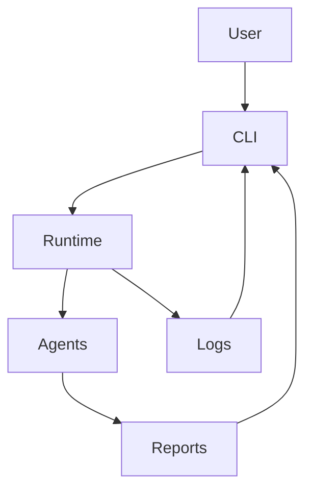
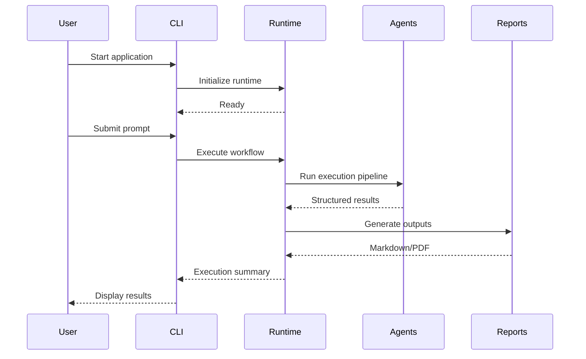
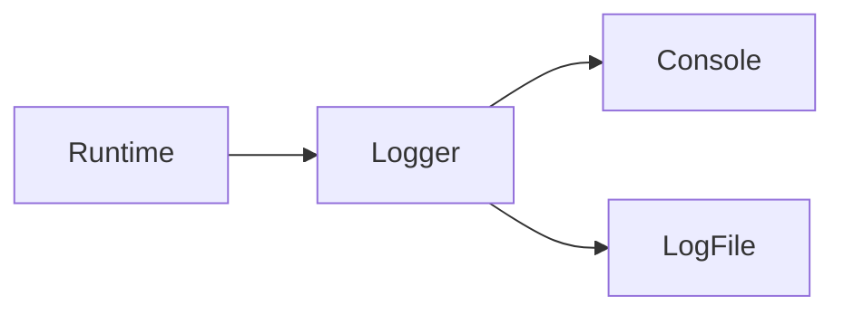

# Command Line Interface (CLI)

> **Reference Guide for the AI Agent Lab Command-Line Interface**

---

# Purpose

The Command Line Interface (CLI) is the primary user interaction layer for AI Agent Lab.

It provides a simple, consistent, and informative interface for executing AI workflows while exposing enough runtime information to support development and troubleshooting.

The CLI is intentionally lightweight. Its responsibilities are limited to:

- Accepting user input
- Displaying runtime progress
- Presenting execution summaries
- Reporting errors
- Providing developer diagnostics

Business logic resides within the runtime and agent layers.

---

# Design Goals

The CLI has been designed around the following principles:

- Simplicity
- Predictability
- Readability
- Minimal cognitive load
- Useful diagnostics
- Consistent formatting

The CLI should communicate **what** the runtime is doing without exposing unnecessary implementation details.

---

# CLI Architecture



The CLI is a presentation layer only. It delegates all execution to the runtime.

---

# Execution Lifecycle

A typical CLI session follows this sequence:



The CLI remains responsive throughout the execution lifecycle by reporting progress at key milestones.

---

# Runtime Banner

Each execution begins with a runtime banner that summarizes the current execution environment.

Example:

```text
========================================================
AI Agent Lab
========================================================

Provider : Gemini
Model    : gemini-2.5-flash
Search   : Tavily

--------------------------------------------------------
```

The banner provides immediate visibility into the active configuration without requiring developers to inspect configuration files.

---

# Runtime Progress

During execution, the CLI reports significant milestones.

Example:

```text
Planning...

Researching...

Synthesizing...

Generating Markdown...

Generating PDF...

Completed.
```

Each stage corresponds to a major phase within the runtime pipeline.

The CLI intentionally avoids displaying implementation-specific details during normal operation.

---

# Execution Summary

After completion, the CLI presents a concise execution summary.

Example:

```text
Execution Complete

Provider        : Gemini
Model           : gemini-2.5-flash
Duration        : 7.3 seconds
Markdown Report : output/report.md
PDF Report      : output/report.pdf
Status          : Success
```

The summary provides developers with the most relevant execution information at a glance.

---

# CLI Responsibilities

The CLI is responsible for:

- Rendering runtime information
- Displaying execution progress
- Accepting prompts
- Reporting success or failure
- Displaying output locations
- Forwarding verbose diagnostics (when enabled)

The CLI should not:

- Execute business logic
- Communicate directly with providers
- Perform reasoning
- Generate reports
- Manage configuration

These responsibilities belong to other architectural layers.

---

# User Experience Principles

The CLI is designed to optimize the developer experience.

Key principles include:

## Progressive Disclosure

Display only the information needed for the current execution mode.

Advanced diagnostics are available through verbose mode.

---

## Clear Status Messages

Every significant runtime stage should communicate:

- What is happening
- Whether it succeeded
- Whether user action is required

---

## Consistent Formatting

Output should remain visually consistent across:

- Success
- Warnings
- Errors
- Verbose diagnostics

Consistency improves readability and simplifies troubleshooting.

---

# Output Philosophy

The CLI favors concise, structured output over excessive verbosity.

Developers should be able to understand execution without scrolling through large amounts of text.

Detailed diagnostics belong in verbose mode and log files rather than the default execution experience.
---

# Execution Modes

AI Agent Lab provides multiple execution modes to support different usage scenarios.

## Standard Mode

Standard mode is optimized for everyday use.

Displayed information includes:

- Runtime banner
- Active provider
- Selected model
- Progress updates
- Output locations
- Execution summary

This mode intentionally suppresses low-level implementation details.

---

## Verbose Mode

Verbose mode is intended for development, debugging, and troubleshooting.

Additional information may include:

- Configuration loading
- Provider initialization
- Search execution
- Agent transitions
- Timing information
- Report generation details
- Runtime diagnostics
- Warning messages

Verbose mode helps developers understand how the runtime behaves internally without requiring changes to the source code.

---

# Verbose Execution Example

```text
Loading configuration...

Configuration validated.

Initializing provider...

Gemini provider initialized.

Initializing search...

Tavily ready.

Creating execution context...

Planner started...

Planner completed (0.4 s)

Research started...

Search completed (1.9 s)

Synthesis started...

Markdown generated.

PDF exported.

Execution completed successfully.
```

The additional output is intended for engineering diagnostics rather than end-user consumption.

---

# Error Presentation

Errors should be presented in a clear and actionable format.

Example:

```text
ERROR

Provider initialization failed.

Reason:

Invalid API key.

Suggested Actions:

• Verify the GEMINI_API_KEY value.
• Check network connectivity.
• Confirm provider availability.
```

Where practical, error messages should include guidance for resolving the issue.

---

# Warning Messages

Warnings communicate recoverable conditions.

Example:

```text
WARNING

Search provider unavailable.

Continuing execution without external search.
```

Warnings should:

- Explain the issue.
- Describe the impact.
- Indicate whether execution will continue.

---

# Logging Integration

The CLI displays runtime information while the logging subsystem records detailed diagnostic events.



The CLI presents only the most relevant information, while logs retain additional diagnostic context for later analysis.

---

# Security Considerations

The CLI should never display sensitive information.

The following values must always be masked:

- API keys
- Authentication tokens
- Secret values
- Personal information

Example:

```text
API Key

AIza*******************
```

Masking should occur before values reach the presentation layer.

---

# Exit Codes

Standardized exit codes improve automation and scripting support.

| Exit Code | Meaning |
|-----------|---------|
| 0 | Successful execution |
| 1 | Runtime error |
| 2 | Configuration error |
| 3 | Provider initialization failure |
| 4 | Search initialization failure |
| 5 | Report generation failure |

Future versions may introduce additional exit codes as the runtime evolves.

---

# Output Formatting Standards

CLI output should remain:

- Consistent
- Readable
- Predictable
- Accessible

Formatting guidelines include:

- Clear section headers
- Consistent indentation
- Minimal visual clutter
- Descriptive status messages
- Stable ordering of information

These standards improve readability and make automated parsing easier if needed.

---

# CLI Extensibility

The CLI is designed to support future enhancements without requiring architectural changes.

Potential additions include:

- Configuration inspection
- Provider listing
- Version information
- Health checks
- Execution history
- Plugin management
- Interactive mode
- Batch execution

Each command should delegate execution to the runtime rather than implementing business logic directly.

---

# Automation Support

The CLI is expected to support scripting and automation workflows.

Future capabilities may include:

- Non-interactive execution
- Configuration via command-line arguments
- Machine-readable output (JSON)
- Quiet mode
- Custom output directories
- Exit status integration with CI/CD pipelines

Automation features should complement the interactive developer experience rather than replace it.

---

# Accessibility

The CLI should remain usable across a wide range of terminal environments.

Guidelines include:

- Avoid reliance on color alone.
- Use plain-text fallbacks where appropriate.
- Keep line lengths reasonable.
- Ensure messages remain understandable in log files and redirected output.

These practices improve usability for developers working in diverse environments.
---

# Command Reference

The CLI currently provides an interactive execution model.

Future releases may introduce additional commands while preserving backward compatibility.

| Command | Description | Status |
|----------|-------------|--------|
| `python main.py` | Start AI Agent Lab | ✅ Available |
| `--verbose` | Enable verbose diagnostics | 🚧 Planned |
| `--provider` | Override configured provider | 📋 Planned |
| `--model` | Override configured model | 📋 Planned |
| `--output` | Specify output directory | 📋 Planned |
| `--format` | Select report format | 📋 Planned |
| `--version` | Display application version | 📋 Planned |
| `--health` | Validate runtime configuration | 📋 Planned |

As new commands are introduced, this reference should be updated accordingly.

---

# Interactive Workflow

A typical interactive session consists of the following steps:

1. Launch the application.
2. Runtime validates configuration.
3. Services are initialized.
4. User enters a prompt.
5. Multi-agent execution begins.
6. Reports are generated.
7. Execution summary is displayed.
8. Application waits for the next request or exits.

This workflow emphasizes simplicity while providing visibility into the execution process.

---

# Troubleshooting

## Runtime Does Not Start

Possible causes:

- Missing configuration
- Invalid environment variables
- Missing dependencies
- Unsupported Python version

Recommended actions:

- Verify `.env` configuration.
- Reinstall project dependencies.
- Confirm Python version.
- Execute the test suite.

---

## Provider Initialization Failure

Possible causes:

- Invalid API key
- Unsupported model
- Network connectivity issues

Suggested actions:

- Verify provider credentials.
- Check provider availability.
- Confirm model configuration.

---

## Report Generation Failure

Possible causes:

- Missing output directory
- File permission issues
- PDF generation dependency problems

Suggested actions:

- Verify output path.
- Check write permissions.
- Review runtime logs.

---

## Search Errors

Possible causes:

- Missing Tavily API key
- Connectivity issues
- Search provider outage

Execution may continue with reduced capabilities depending on the request.

---

# Best Practices

To ensure a consistent developer experience:

- Keep dependencies up to date.
- Use a virtual environment.
- Validate configuration before execution.
- Review runtime summaries after each run.
- Use verbose mode when diagnosing issues.
- Update documentation whenever CLI behavior changes.

---

# CLI Roadmap

Future enhancements under consideration include:

## User Experience

- Interactive prompt history
- Progress indicators
- Rich terminal formatting
- Improved accessibility
- Configurable themes

---

## Automation

- Non-interactive mode
- Batch processing
- Configuration overrides
- JSON output
- CI/CD integration

---

## Diagnostics

- Runtime health checks
- Configuration validation command
- Provider capability inspection
- Execution metrics
- Performance profiling

These enhancements aim to improve usability while preserving the CLI's simplicity.

---

# CLI Design Checklist

When introducing new CLI functionality, verify the following:

- [ ] Consistent command naming
- [ ] Clear help text
- [ ] Stable output format
- [ ] Meaningful error messages
- [ ] Documentation updated
- [ ] Automated tests added
- [ ] Backward compatibility maintained

---

# Related Documentation

For additional information, refer to:

| Document | Purpose |
|----------|---------|
| `README.md` | Project overview |
| `SETUP.md` | Installation and configuration |
| `ARCHITECTURE.md` | Runtime architecture |
| `PROVIDERS.md` | Provider integrations |
| `OBSERVABILITY.md` | Logging and diagnostics |
| `ROADMAP.md` | Planned enhancements |
| `CHANGELOG.md` | Release history |

---

# Maintaining This Document

Update this guide whenever changes affect:

- Available commands
- Runtime output
- Execution flow
- CLI options
- Exit codes
- Error handling
- User interaction model

The CLI guide should always reflect the behavior of the current release.

---

# Conclusion

The CLI provides a simple yet powerful interface to AI Agent Lab.

By separating presentation from runtime execution, the architecture keeps the interface lightweight while allowing the underlying system to evolve independently.

As AI Agent Lab grows, the CLI will continue to evolve to support richer workflows, better diagnostics, and improved automation without compromising clarity or ease of use.

---

**Document Version:** v0.7.1

**Last Updated:** July 2026

**Status:** Active