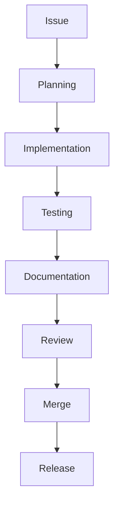

# Contributing Guide

> **Development Workflow and Contribution Standards for AI Agent Lab**

---

# Purpose

This document describes the standards, workflows, and expectations for contributing to AI Agent Lab.

Whether contributing a bug fix, documentation improvement, new provider, or architectural enhancement, all contributions should follow a consistent engineering process.

The goals of this guide are to:

- Maintain code quality
- Preserve architectural consistency
- Simplify onboarding
- Improve collaboration
- Reduce maintenance overhead

---

# Guiding Principles

Every contribution should reinforce the project's engineering philosophy.

Core principles include:

- Simplicity over complexity
- Readability over cleverness
- Maintainability over shortcuts
- Documentation alongside implementation
- Incremental improvements
- Consistent architecture

A contribution that aligns with these principles is more valuable than one that simply adds functionality.

---

# Development Workflow

The recommended workflow consists of the following stages:



Each stage should be completed before progressing to the next.

---

# Repository Structure

Contributors should become familiar with the repository organization before making changes.

```text
AI-Lab/

├── Docs/
├── Projects/
│   └── ai-agent-lab/
│       ├── config/
│       ├── llm/
│       ├── runtime/
│       ├── agents/
│       ├── search/
│       ├── reports/
│       ├── tests/
│       └── docs/
```

Changes should remain localized to the relevant subsystem whenever possible.

---

# Branching Strategy

Development should occur on feature branches rather than directly on the main branch.

Suggested naming conventions include:

```text
feature/provider-groq

feature/plugin-system

feature/report-improvements

bugfix/provider-timeout

bugfix/runtime-startup

docs/architecture-update

docs/readme-improvements

refactor/provider-interface
```

Branch names should clearly communicate the purpose of the work.

---

# Commit Guidelines

Commits should be:

- Small
- Focused
- Descriptive
- Atomic

Avoid combining unrelated changes into a single commit.

Recommended commit prefixes include:

```text
feat:

fix:

docs:

refactor:

test:

chore:

ci:
```

Examples:

```text
feat: add provider health checks

fix: normalize timeout exceptions

docs: update architecture diagrams

refactor: simplify provider factory

test: add integration tests for Gemini provider
```

Consistent commit history improves traceability and simplifies future maintenance.

---

# Coding Standards

General coding expectations include:

- Follow PEP 8
- Use meaningful names
- Prefer composition over inheritance
- Keep functions focused
- Avoid duplicated logic
- Write clear comments only where necessary

Readable code is preferred over overly compact implementations.

---

# Module Responsibilities

Every module should have a clearly defined responsibility.

Examples:

| Module | Responsibility |
|---------|----------------|
| Runtime | Workflow orchestration |
| Providers | LLM integrations |
| Agents | Specialized reasoning tasks |
| Reports | Output generation |
| Search | External information retrieval |
| Config | Application configuration |

Avoid introducing cross-cutting responsibilities into unrelated modules.

---

# Documentation Expectations

Documentation is considered part of the implementation.

Contributors should update documentation whenever changes affect:

- User workflows
- Configuration
- Architecture
- CLI behavior
- Provider integrations
- Public interfaces

Code and documentation should remain synchronized across releases.

---

# Testing Requirements

Every functional change should include appropriate validation.

Testing may include:

- Unit tests
- Integration tests
- Manual verification
- Regression testing

Features should not be considered complete until their behavior has been verified.

---

# Code Review Philosophy

Code reviews are collaborative rather than adversarial.

Reviewers should evaluate:

- Correctness
- Maintainability
- Readability
- Architectural consistency
- Test coverage
- Documentation quality

Constructive feedback improves both the implementation and the overall project quality.

---

# Definition of Done

A contribution is considered complete when:

- Functionality is implemented.
- Tests pass.
- Documentation is updated.
- Logging remains appropriate.
- No unnecessary complexity has been introduced.
- Code review feedback has been addressed.

Meeting these criteria helps maintain a high standard across the project.
---

# Pull Request Process

All changes should be submitted through a pull request (PR), even for small improvements. This promotes code review, discussion, and documentation before merging.

A typical pull request should include:

- A clear description of the change
- The motivation behind the change
- Testing performed
- Documentation updates
- Any known limitations or follow-up work

Pull requests should remain focused on a single logical change whenever possible.

---

# Pull Request Checklist

Before opening a pull request, verify the following:

- [ ] Code builds successfully
- [ ] Tests pass
- [ ] Documentation updated
- [ ] Logging reviewed
- [ ] Configuration changes documented
- [ ] Changelog updated (if applicable)
- [ ] No unrelated changes included

Following this checklist helps streamline reviews and reduce rework.

---

# Documentation Contributions

Documentation should evolve alongside the implementation.

When updating documentation:

- Keep language clear and concise.
- Use consistent terminology.
- Include examples where helpful.
- Update diagrams if architecture changes.
- Remove outdated information promptly.

Documentation should be treated as a first-class project artifact rather than an afterthought.

---

# Reporting Issues

When reporting a bug or unexpected behavior, include:

- AI Agent Lab version
- Operating system
- Python version
- Active provider
- Model name
- Steps to reproduce
- Expected behavior
- Actual behavior
- Relevant log output (with sensitive information removed)

Providing complete information helps reproduce and resolve issues more efficiently.

---

# Feature Requests

Feature requests should explain:

- The problem being solved
- Why existing functionality is insufficient
- Proposed approach (if applicable)
- Expected benefits
- Potential trade-offs

Requests that align with the project's guiding principles are more likely to be prioritized.

---

# Security Reporting

If you discover a security issue:

- Do not publish sensitive details publicly before the issue is addressed.
- Provide a clear description of the vulnerability.
- Include reproduction steps where appropriate.
- Describe the potential impact.

Security-related fixes should be prioritized over feature development.

---

# Contributor Responsibilities

Contributors are expected to:

- Follow project conventions.
- Respect architectural boundaries.
- Write maintainable code.
- Keep documentation current.
- Add or update tests where appropriate.
- Participate constructively in code reviews.

These responsibilities help maintain a healthy and sustainable project.

---

# Community Expectations

All contributors should foster a collaborative and respectful environment.

Expected behaviors include:

- Respect differing perspectives.
- Provide constructive feedback.
- Assume positive intent.
- Focus discussions on technical merit.
- Encourage knowledge sharing.

Healthy collaboration contributes to better engineering outcomes.

---

# Contributor Checklist

Before considering work complete, verify:

## Implementation

- [ ] Feature implemented
- [ ] Code reviewed
- [ ] Architecture respected

---

## Quality

- [ ] Tests added or updated
- [ ] Existing tests pass
- [ ] No unnecessary complexity introduced

---

## Documentation

- [ ] README updated (if required)
- [ ] Relevant guides updated
- [ ] Changelog updated
- [ ] Examples remain accurate

---

## Validation

- [ ] Manual testing completed
- [ ] Edge cases considered
- [ ] Logging reviewed
- [ ] Error handling verified

---

# Related Documentation

For additional guidance, refer to:

| Document | Purpose |
|----------|---------|
| `README.md` | Project overview |
| `SETUP.md` | Installation and configuration |
| `ARCHITECTURE.md` | System architecture |
| `CLI.md` | Command-line interface |
| `PROVIDERS.md` | Provider integrations |
| `OBSERVABILITY.md` | Logging and diagnostics |
| `ROADMAP.md` | Strategic direction |
| `CHANGELOG.md` | Release history |

---

# Maintaining This Document

Update this guide whenever changes affect:

- Development workflow
- Coding standards
- Review process
- Branching strategy
- Testing expectations
- Documentation practices
- Contribution requirements

Keeping this guide current ensures contributors have an accurate reference for participating in the project.

---

# Conclusion

AI Agent Lab is intended to be built through disciplined, collaborative engineering.

By following shared standards for implementation, testing, documentation, and review, contributors can help the project evolve in a consistent and maintainable manner.

This guide should serve as the primary reference for contributing to the project and should evolve alongside the codebase as new workflows and practices emerge.

---

**Document Version:** v0.7.1

**Last Updated:** July 2026

**Status:** Active