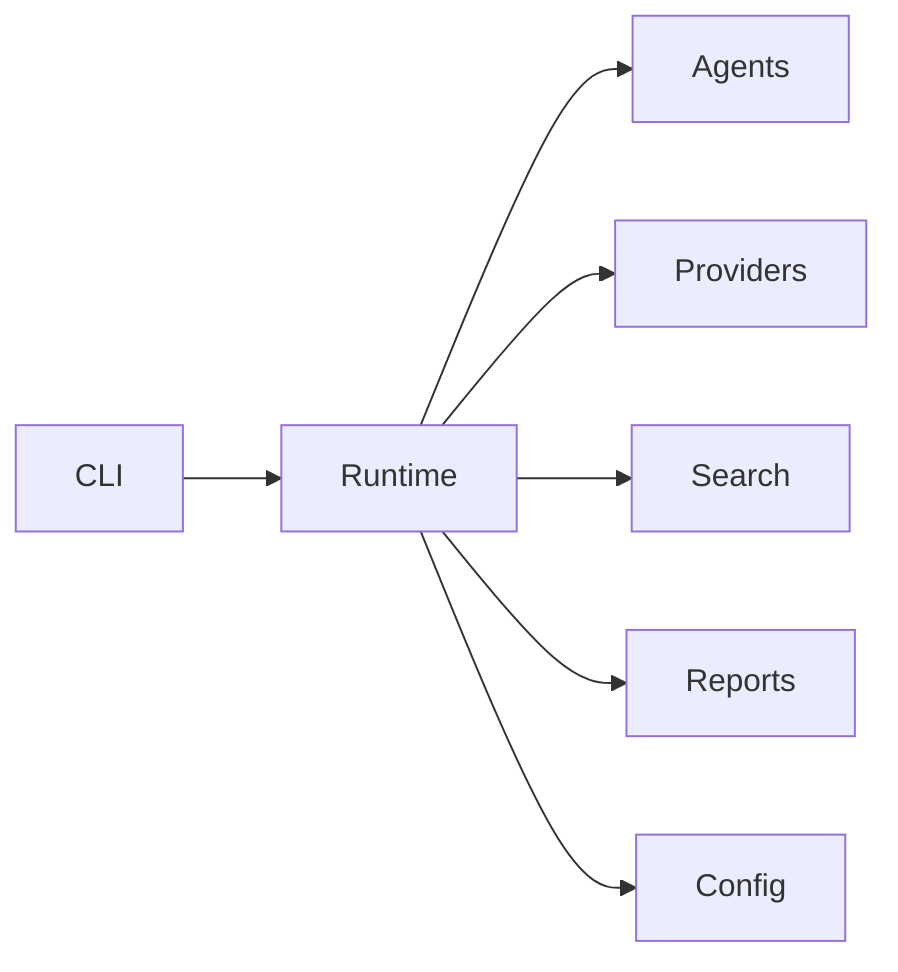

# Developer Guide

> **Practical Handbook for Contributing to AI Agent Lab**

---

# Purpose

This guide provides practical instructions for developers working on AI Agent Lab.

Where other documentation explains *what* the system does, this guide focuses on *how* to work effectively within the codebase.

It is intended for:

- New contributors
- Project maintainers
- Feature developers
- Reviewers
- Anyone extending the platform

---

# Guiding Principles

Development should emphasize:

- Simplicity over cleverness
- Readability over brevity
- Modularity over duplication
- Stability over rapid change
- Documentation alongside implementation

Every contribution should improve the project without increasing unnecessary complexity.

---

# Project Structure

A simplified view of the repository:

```text
AI-Lab/
│
├── docs/
├── projects/
│   └── ai-agent-lab/
│       ├── agents/
│       ├── config/
│       ├── llm/
│       ├── reports/
│       ├── search/
│       ├── runtime/
│       ├── utils/
│       ├── tests/
│       └── docs/
└── README.md
```

Each directory has a clearly defined responsibility.

---

# Architecture Overview



The runtime coordinates the workflow while individual modules remain focused on a single responsibility.

Developers should preserve this separation of concerns when introducing new functionality.

---

# Development Workflow

A typical development cycle consists of:

1. Create a feature branch.
2. Review existing documentation.
3. Implement the feature.
4. Add or update tests.
5. Update documentation.
6. Run validation checks.
7. Submit a pull request.

Keeping changes small and focused makes reviews faster and reduces integration risk.

---

# Local Development

Before making changes:

- Clone the repository.
- Install project dependencies.
- Configure required environment variables.
- Verify provider credentials.
- Run the existing test suite.

Starting from a known-good state simplifies debugging and reduces time spent diagnosing unrelated issues.

---

# Development Environment

Recommended tools include:

- Python
- Git
- Visual Studio Code (or equivalent)
- Virtual environment manager
- Markdown preview extension
- Static analysis tools

Using a consistent environment improves reproducibility across contributors.

---

# Coding Standards

General guidelines:

- Follow PEP 8.
- Prefer descriptive names.
- Keep functions focused.
- Limit function length.
- Avoid deeply nested logic.
- Write meaningful docstrings where appropriate.

Readable code is easier to review, test, and maintain.

---

# Working with the Runtime

The runtime should remain the central orchestration layer.

When adding features:

- Avoid embedding business logic directly in the runtime.
- Delegate responsibilities to appropriate modules.
- Keep orchestration separate from implementation.

A lean runtime simplifies future evolution.

---

# Working with Agents

Agents should:

- Solve one well-defined problem.
- Accept structured inputs.
- Return structured outputs.
- Avoid direct provider initialization.
- Avoid unnecessary dependencies on other agents.

Independent agents are easier to test and reuse.

---

# Working with Providers

Provider implementations should:

- Follow the common provider interface.
- Normalize responses.
- Translate provider-specific errors.
- Avoid leaking SDK-specific details into the runtime.

The provider abstraction enables new integrations with minimal changes elsewhere in the system.

---

# Working with Search

Search implementations should:

- Normalize results.
- Handle transient failures gracefully.
- Respect configured timeouts.
- Avoid embedding business logic.

Search providers should remain interchangeable through the shared interface.

---

# Working with Reports

Report generators should focus solely on presentation.

Responsibilities include:

- Formatting structured results.
- Generating output artifacts.
- Applying consistent layouts.

Report generators should not perform reasoning, provider calls, or workflow orchestration.

---

# Configuration Management

Configuration should be accessed through the configuration subsystem rather than reading environment variables directly.

Benefits include:

- Centralized validation
- Consistent defaults
- Easier testing
- Reduced duplication

New configuration values should be documented and validated before use.
---

# Adding a New Agent

Agents encapsulate a single stage of the execution workflow.

## Step 1: Create the Agent

Create a new module under:

```text
agents/
```

Example:

```text
agents/
    summarizer_agent.py
```

Each agent should have a clearly defined responsibility.

---

## Step 2: Implement the Interface

Every agent should expose a consistent public interface.

Typical responsibilities include:

- Accepting structured input
- Performing one logical task
- Returning structured output
- Reporting recoverable errors

Agents should avoid direct interaction with provider SDKs whenever possible.

---

## Step 3: Register the Agent

Update the runtime so the new agent participates in the workflow where appropriate.

Consider:

- Execution order
- Dependencies
- Failure handling
- Shared execution context

Avoid introducing unnecessary coupling between agents.

---

## Step 4: Add Tests

Each new agent should include:

- Unit tests
- Error handling tests
- Edge case validation
- Integration tests where applicable

Testing should focus on observable behavior rather than implementation details.

---

# Adding a New Provider

Provider integrations should remain isolated from the runtime.

Typical implementation steps:

1. Create a new provider module.
2. Implement the common provider interface.
3. Normalize responses.
4. Translate provider-specific errors.
5. Register the provider with the factory or registry.
6. Add provider-specific tests.

The runtime should not require changes beyond provider registration.

---

# Provider Development Checklist

Before merging a new provider:

- [ ] Authentication implemented
- [ ] Response normalization completed
- [ ] Error handling verified
- [ ] Configuration documented
- [ ] Unit tests added
- [ ] Integration tests completed
- [ ] Documentation updated

Following a consistent checklist improves reliability across provider implementations.

---

# Adding a New Search Provider

Search providers should integrate through the shared search interface.

Implementation steps:

1. Create a new search module.
2. Implement the common search contract.
3. Normalize results.
4. Handle retries and timeouts.
5. Register the provider.
6. Add automated tests.

Search implementations should not embed workflow-specific logic.

---

# Adding a New Report Generator

Report generators transform structured execution results into user-facing artifacts.

Typical steps:

1. Create a new generator.
2. Accept structured report input.
3. Produce the desired output format.
4. Validate generated artifacts.
5. Register the generator if required.

Examples of future report formats include:

- HTML
- DOCX
- JSON
- Interactive dashboards

---

# Writing Tests

Every feature should include automated tests.

Recommended testing pyramid:

```text
Integration Tests
        ▲
        │
Contract Tests
        ▲
        │
Unit Tests
```

Unit tests should make up the majority of the test suite.

---

# Unit Testing

Unit tests should verify:

- Input validation
- Business logic
- Expected outputs
- Boundary conditions
- Error handling

Tests should remain deterministic and independent of external services.

---

# Integration Testing

Integration tests validate interactions between subsystems.

Examples include:

- Runtime + Provider
- Runtime + Search
- Runtime + Reporting
- Runtime + Configuration

These tests help detect interface regressions early.

---

# Debugging Techniques

When diagnosing issues:

1. Reproduce the problem consistently.
2. Review logs.
3. Isolate the failing subsystem.
4. Verify configuration.
5. Test components independently.
6. Narrow the scope before modifying code.

Avoid changing multiple variables simultaneously during debugging.

---

# Logging Best Practices

Log messages should be:

- Clear
- Actionable
- Consistent
- Context-rich

Avoid logging:

- Secrets
- API keys
- Sensitive user data
- Personally identifiable information

Meaningful logs simplify troubleshooting without compromising security.

---

# Common Development Tasks

Typical maintenance activities include:

- Updating dependencies
- Refactoring modules
- Improving documentation
- Expanding test coverage
- Optimizing performance
- Reviewing provider compatibility

Small, incremental improvements are generally preferable to large-scale rewrites.
---

# Code Review Expectations

Every change submitted to AI Agent Lab should undergo a structured review.

Reviewers should evaluate:

- Correctness
- Readability
- Architectural consistency
- Test coverage
- Documentation completeness
- Performance implications
- Security considerations

The objective is to improve the codebase, not simply approve changes.

---

# Pull Request Guidelines

Keep pull requests:

- Small
- Focused
- Self-contained
- Well documented

Each pull request should include:

- A clear description of the change
- The motivation behind the change
- Testing performed
- Documentation updates
- Any known limitations

Smaller pull requests are easier to review, test, and merge.

---

# Performance Optimization

Performance improvements should be driven by evidence rather than assumptions.

Recommended workflow:

1. Measure current performance.
2. Identify bottlenecks.
3. Optimize incrementally.
4. Validate improvements.
5. Document significant changes.

Avoid premature optimization that increases complexity without measurable benefit.

---

# Dependency Management

Dependencies should be introduced carefully.

Before adding a new dependency, consider:

- Maintenance activity
- Community support
- License compatibility
- Security history
- Project size
- Long-term viability

Prefer existing standard library functionality where appropriate.

---

# Refactoring Guidelines

Refactoring should improve the code without altering external behavior.

Typical goals include:

- Reducing duplication
- Improving readability
- Simplifying interfaces
- Improving testability
- Removing obsolete code

Large refactors should be broken into smaller, reviewable changes whenever possible.

---

# Common Pitfalls

Avoid the following patterns:

- Mixing orchestration with business logic
- Hardcoding provider-specific behavior
- Bypassing configuration management
- Ignoring normalized error handling
- Returning inconsistent data structures
- Introducing unnecessary global state

These patterns increase coupling and make the system more difficult to maintain.

---

# Anti-Patterns

Examples of architectural anti-patterns include:

- Direct SDK usage outside provider modules
- Business logic inside report generators
- Environment variable access outside the configuration layer
- Circular module dependencies
- Excessive inheritance where composition is sufficient

Contributors should favor modular, loosely coupled designs.

---

# Documentation Practices

Documentation should evolve alongside the implementation.

When introducing new functionality:

- Update relevant guides.
- Add examples where helpful.
- Document configuration changes.
- Record public API updates.
- Update architectural diagrams if required.

Accurate documentation is a core project deliverable rather than an afterthought.

---

# Continuous Improvement

The project encourages iterative improvement.

Examples include:

- Simplifying interfaces
- Expanding test coverage
- Improving diagnostics
- Reducing technical debt
- Enhancing developer experience

Incremental improvements often have a greater long-term impact than infrequent large changes.

---

# Contributor Checklist

Before submitting changes, verify:

## Code Quality

- [ ] Code follows project conventions.
- [ ] Functions have clear responsibilities.
- [ ] Public interfaces remain stable.
- [ ] Error handling is implemented.

---

## Testing

- [ ] Unit tests added or updated.
- [ ] Integration tests pass.
- [ ] Manual validation completed.

---

## Documentation

- [ ] Relevant documentation updated.
- [ ] Examples remain accurate.
- [ ] Configuration changes documented.
- [ ] Changelog updated where applicable.

---

## Review Readiness

- [ ] No debugging artifacts remain.
- [ ] No unused code introduced.
- [ ] Commit history is clean.
- [ ] Pull request description is complete.

---

# Related Documentation

For additional guidance, refer to:

| Document | Purpose |
|----------|---------|
| `ARCHITECTURE.md` | System architecture |
| `API_REFERENCE.md` | Public interfaces |
| `CONTRIBUTING.md` | Contribution workflow |
| `SETUP.md` | Local environment setup |
| `CLI.md` | Command-line usage |
| `PROVIDERS.md` | Provider implementations |
| `OBSERVABILITY.md` | Logging and diagnostics |
| `ROADMAP.md` | Future direction |

---

# Maintaining This Document

Update this guide whenever changes affect:

- Development workflow
- Project structure
- Extension points
- Testing practices
- Coding standards
- Review expectations
- Recommended tools

Keeping this guide current ensures new contributors can become productive quickly and experienced contributors have a consistent reference.

---

# Conclusion

The long-term success of AI Agent Lab depends on consistent engineering practices as much as technical architecture.

By following the guidance in this document, contributors can extend the platform confidently while preserving readability, modularity, reliability, and maintainability.

This guide should serve as the practical companion to the architecture and API documentation, helping developers implement changes in a way that aligns with the project's design principles and quality standards.

---

**Document Version:** v0.7.1

**Last Updated:** July 2026

**Status:** Active