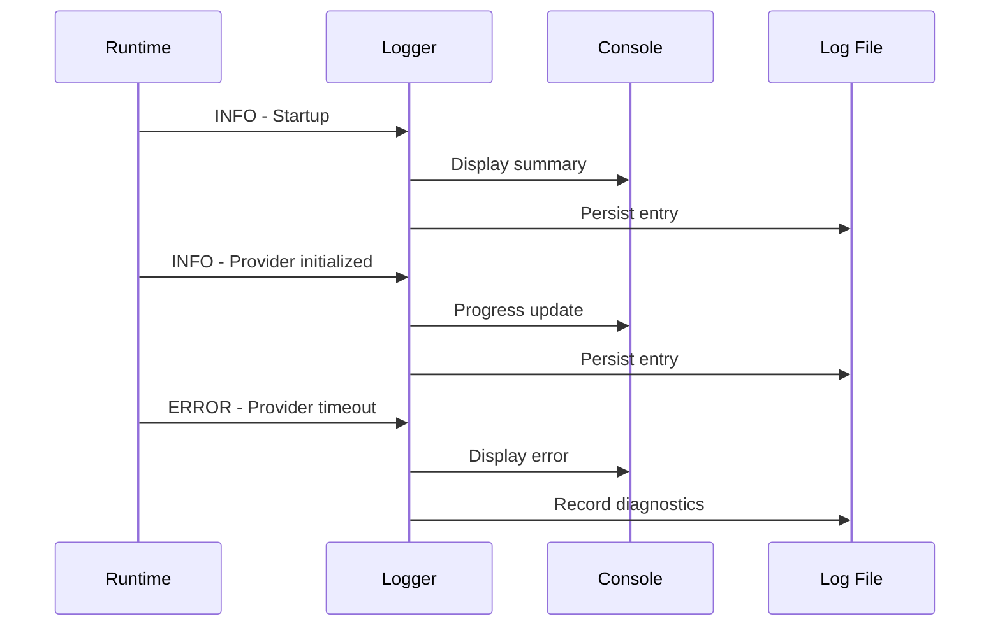

# Observability Guide

> **Logging, Monitoring, Metrics, and Diagnostics for AI Agent Lab**

---

# Purpose

Observability enables developers to understand the internal behavior of AI Agent Lab without directly inspecting the implementation.

A well-designed observability strategy answers questions such as:

- What happened?
- When did it happen?
- Which component executed?
- How long did it take?
- Why did it fail?
- How can it be reproduced?

This guide describes the logging architecture, diagnostic strategy, metrics, and best practices used throughout the project.

---

# Design Goals

The observability subsystem is designed to provide:

- Clear diagnostics
- Consistent logging
- Actionable error reporting
- Performance insights
- Minimal runtime overhead
- Extensibility for future telemetry

Observability should improve maintainability without increasing system complexity.

---

# Observability Architecture

```mermaid
flowchart TD

Runtime

Logger

Metrics

Diagnostics

Console

Log Files

Runtime --> Logger

Logger --> Console

Logger --> Log Files

Logger --> Metrics

Logger --> Diagnostics
```

The logger acts as the central collection point for runtime events.

---

# Core Components

The observability layer consists of four primary components.

## Logging

Captures runtime events and execution details.

Examples:

- Startup
- Configuration
- Provider initialization
- Agent execution
- Report generation
- Shutdown

---

## Metrics

Measures runtime characteristics such as:

- Execution duration
- Provider latency
- Search latency
- Token usage (where available)
- Error counts
- Retry attempts

Metrics help identify performance bottlenecks and operational trends.

---

## Diagnostics

Diagnostics provide detailed context for failures.

Examples include:

- Stack traces
- Configuration validation errors
- Provider failures
- Runtime state
- Dependency initialization

Diagnostics should be detailed enough to support troubleshooting while avoiding exposure of sensitive information.

---

## Console Output

The console presents concise runtime information to developers.

Typical output includes:

- Startup banner
- Progress updates
- Warnings
- Errors
- Execution summary

Verbose diagnostic information belongs in log files rather than standard console output.

---

# Logging Principles

Logging should follow several guiding principles.

## Structured

Log entries should be consistent and machine-readable where practical.

Each event should include:

- Timestamp
- Severity
- Component
- Message
- Context (when applicable)

---

## Meaningful

Every log entry should communicate useful information.

Avoid messages such as:

```text
Something happened.
```

Prefer:

```text
Provider initialization completed successfully.
```

Clear messages simplify debugging and reduce ambiguity.

---

## Actionable

When logging errors or warnings, include enough information to guide corrective action.

Example:

```text
Configuration validation failed.

Missing environment variable:

GEMINI_API_KEY
```

Developers should understand both the issue and the next step.

---

## Minimal

Avoid excessive logging.

Logs should provide insight without overwhelming developers.

High-frequency events should be logged selectively, particularly in production environments.

---

# Log Levels

AI Agent Lab uses standardized log levels to categorize runtime events.

| Level | Purpose |
|--------|---------|
| DEBUG | Detailed diagnostic information |
| INFO | Normal runtime events |
| WARNING | Recoverable issues |
| ERROR | Execution failures |
| CRITICAL | System-level failures requiring immediate attention |

Consistent use of log levels improves filtering and analysis.

---

# Typical Logging Flow



This flow separates concise user-facing output from detailed diagnostic records.

---

# Log Entry Format

A standardized log format improves readability and supports automated analysis.

Example:

```text
2026-07-25 10:15:42

INFO

Provider

Gemini provider initialized successfully.
```

Additional structured fields may be included depending on the logging framework.

---

# Correlation and Context

Where possible, related log entries should share contextual information, such as:

- Execution identifier
- Request identifier
- Active provider
- Selected model

Correlating events across components simplifies tracing and debugging, especially as the system grows in complexity.
---

# Performance Metrics

Performance metrics help developers understand how efficiently the runtime operates and identify opportunities for optimization.

The observability layer should collect metrics that are:

- Relevant
- Lightweight
- Consistent
- Actionable

---

# Core Runtime Metrics

The following metrics are recommended for every execution.

| Metric | Description |
|---------|-------------|
| Execution Duration | Total workflow execution time |
| Runtime Initialization | Startup time before execution |
| Provider Latency | Time spent waiting for LLM responses |
| Search Latency | External search execution time |
| Report Generation | Time required to generate artifacts |
| Retry Count | Number of retry attempts |
| Error Count | Number of runtime errors |
| Warning Count | Number of recoverable issues |

These metrics provide a high-level view of system performance without excessive instrumentation.

---

# Provider Metrics

Provider-specific metrics help compare model performance and diagnose provider-related issues.

Potential measurements include:

- Request duration
- Response duration
- Time to first token (for streaming providers)
- Total token usage
- Prompt token count
- Completion token count
- Provider error rate
- Rate-limit events

Where providers expose usage metadata, these values should be normalized before being consumed by the runtime.

---

# Search Metrics

The search subsystem may expose metrics such as:

- Query execution time
- Number of sources retrieved
- Search provider latency
- Failed search requests
- Search retry attempts

These measurements help distinguish search-related delays from LLM inference latency.

---

# Error Handling Strategy

The observability subsystem should record failures consistently across all components.

Errors should include:

- Severity
- Component
- Timestamp
- Error category
- Human-readable description
- Diagnostic context (where appropriate)

This information supports rapid troubleshooting while maintaining a consistent developer experience.

---

# Error Categories

Errors may be grouped into the following categories.

| Category | Examples |
|----------|----------|
| Configuration | Missing environment variables, invalid settings |
| Authentication | Invalid API keys, expired credentials |
| Network | Connection failures, DNS issues |
| Provider | Invalid requests, model errors |
| Search | Search provider failures |
| Reporting | Markdown/PDF generation failures |
| Internal | Unexpected runtime exceptions |

Categorizing errors improves reporting and enables future analytics.

---

# Debugging Workflow

A recommended debugging workflow is outlined below.

```mermaid
flowchart TD

Issue Reported

Review Console Output

Inspect Log Files

Identify Component

Reproduce Issue

Apply Fix

Re-run Validation

Issue Reported --> Review Console Output
Review Console Output --> Inspect Log Files
Inspect Log Files --> Identify Component
Identify Component --> Reproduce Issue
Reproduce Issue --> Apply Fix
Apply Fix --> Re-run Validation
```

Following a consistent workflow reduces investigation time and improves reproducibility.

---

# Sensitive Data Handling

Observability must never compromise security.

The following data should not appear in logs:

- API keys
- Authentication tokens
- Passwords
- Personally identifiable information (PII)
- Raw secrets
- Private credentials

When necessary, values should be masked before logging.

Example:

```text
API Key

AIza*******************
```

---

# Log Retention

As the project evolves, log retention policies should balance diagnostic value with storage efficiency.

General recommendations include:

- Retain recent logs for active development.
- Archive historical logs if needed.
- Rotate log files periodically.
- Remove obsolete logs automatically.

Retention strategies should be configurable rather than hardcoded.

---

# Monitoring Recommendations

Future deployments may integrate with external monitoring systems.

Potential integrations include:

- Prometheus
- Grafana
- OpenTelemetry
- Cloud-native monitoring platforms

These tools can provide dashboards, long-term metrics, and operational visibility beyond local development.

---

# Alerting Strategy

Alerts should be reserved for significant runtime events that require developer attention.

Examples include:

- Repeated provider failures
- Consecutive authentication errors
- High error rates
- Excessive execution latency
- Report generation failures
- Resource exhaustion

Alerts should prioritize actionable information and avoid excessive noise.

---

# Runtime Health Diagnostics

Health diagnostics help verify that the application is ready to process requests.

Typical checks may include:

- Configuration validation
- Provider initialization
- Search provider availability
- Output directory accessibility
- Dependency availability

A future `--health` CLI command may execute these checks and report readiness before workflow execution.

---

# Diagnostic Best Practices

To maximize the value of observability:

- Log meaningful events rather than every internal operation.
- Use consistent severity levels.
- Include sufficient context for troubleshooting.
- Avoid duplicating the same information across multiple log entries.
- Review and refine logging as new features are introduced.

Observability should support developers without becoming a source of unnecessary complexity.
---

# Structured Logging Examples

Consistent log formatting improves readability and enables future integration with log aggregation and monitoring tools.

## Startup

```text
2026-07-25 09:15:42

INFO

Runtime

AI Agent Lab runtime initialized successfully.
```

---

## Provider Initialization

```text
2026-07-25 09:15:43

INFO

Provider

Gemini provider initialized.

Model: gemini-2.5-flash
```

---

## Workflow Execution

```text
2026-07-25 09:15:44

INFO

Planner

Planning phase completed successfully.
```

---

## Warning

```text
2026-07-25 09:15:46

WARNING

Search

Search provider unavailable.

Continuing without external search.
```

---

## Error

```text
2026-07-25 09:15:48

ERROR

Provider

Request timed out.

Retry attempt 1 of 3.
```

These examples illustrate the expected consistency across runtime events.

---

# Future Telemetry Roadmap

As AI Agent Lab evolves, the observability subsystem may expand to include richer telemetry capabilities.

Potential enhancements include:

- Distributed tracing
- OpenTelemetry support
- Centralized log aggregation
- Real-time metrics dashboards
- Execution history
- Performance benchmarking
- Provider comparison analytics
- Cost tracking
- Token consumption reporting
- Execution profiling

These capabilities should be introduced incrementally while maintaining the lightweight developer experience.

---

# Troubleshooting Playbook

The following playbook provides a structured approach to investigating runtime issues.

## Step 1 – Review Console Output

Identify:

- Error messages
- Warning messages
- Execution stage
- Exit status

---

## Step 2 – Inspect Log Files

Review:

- Initialization sequence
- Provider events
- Search events
- Stack traces
- Retry attempts

---

## Step 3 – Verify Configuration

Confirm:

- Environment variables
- Provider selection
- Model configuration
- API credentials

---

## Step 4 – Isolate the Component

Determine whether the issue originates from:

- Runtime
- Provider
- Search subsystem
- Reporting
- Configuration
- External dependency

---

## Step 5 – Reproduce

Attempt to reproduce the issue using:

- A minimal prompt
- Verbose logging
- Known-good configuration
- Stable network connectivity

---

## Step 6 – Validate the Fix

After applying changes:

- Execute unit tests.
- Run integration tests.
- Verify log output.
- Confirm runtime behavior.
- Update documentation if necessary.

---

# Observability Checklist

The following checklist may be used during development and code reviews.

## Logging

- [ ] Meaningful log messages
- [ ] Consistent severity levels
- [ ] Structured formatting
- [ ] No duplicate entries
- [ ] Sensitive data masked

---

## Metrics

- [ ] Execution duration captured
- [ ] Provider latency measured
- [ ] Search latency measured
- [ ] Error counts recorded
- [ ] Retry counts recorded

---

## Diagnostics

- [ ] Helpful error messages
- [ ] Sufficient execution context
- [ ] Component identification
- [ ] Clear remediation guidance

---

## Security

- [ ] API keys never logged
- [ ] Tokens masked
- [ ] Sensitive prompts protected
- [ ] Personal information excluded

---

## Documentation

- [ ] Logging changes documented
- [ ] New metrics documented
- [ ] Troubleshooting guide updated
- [ ] Examples remain accurate

---

# Related Documentation

For additional information, refer to:

| Document | Purpose |
|----------|---------|
| `ARCHITECTURE.md` | System architecture |
| `CLI.md` | Command-line interface |
| `PROVIDERS.md` | LLM provider integrations |
| `SETUP.md` | Installation and configuration |
| `ROADMAP.md` | Planned enhancements |
| `CHANGELOG.md` | Release history |

---

# Maintaining This Document

Update this guide whenever changes affect:

- Logging behavior
- Metrics collection
- Diagnostic output
- Error handling
- Monitoring integrations
- Alerting strategy
- Health checks
- Telemetry capabilities

Observability documentation should evolve alongside the runtime to remain an accurate operational reference.

---

# Conclusion

Effective observability is essential for building reliable AI systems.

By combining structured logging, meaningful diagnostics, actionable metrics, and disciplined operational practices, AI Agent Lab provides developers with the visibility needed to understand, troubleshoot, and improve the system over time.

The observability subsystem is intentionally designed to scale with the project, supporting both local development and future production deployments.

---

**Document Version:** v0.7.1

**Last Updated:** July 2026

**Status:** Active