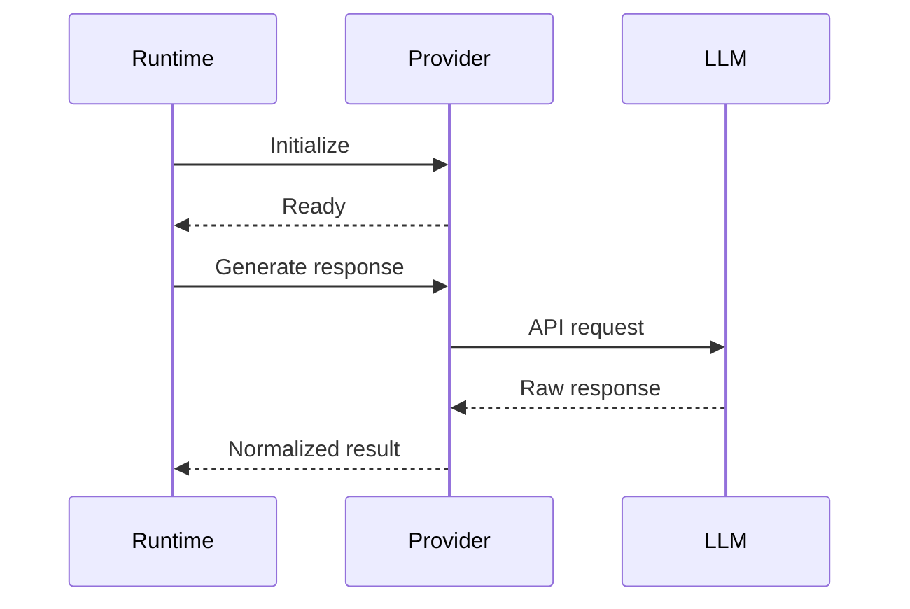
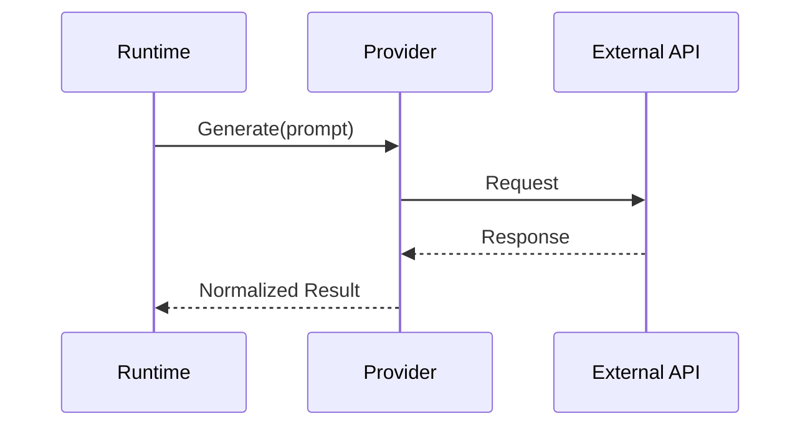

# Provider Integration Guide

> **Reference Guide for Large Language Model (LLM) Provider Integration**

---

# Purpose

AI Agent Lab is designed around a provider-agnostic architecture.

Rather than coupling application logic to a specific LLM vendor, the system introduces a provider abstraction layer that enables seamless integration with multiple AI services through a consistent interface.

This document describes:

- Provider architecture
- Interface contracts
- Supported providers
- Configuration
- Runtime behavior
- Extension guidelines
- Best practices

---

# Design Goals

The provider layer has been designed to achieve the following objectives:

- Vendor independence
- Consistent interfaces
- Easy extensibility
- Runtime configurability
- Testability
- Fault isolation

These goals allow the application to evolve independently of any specific LLM provider.

---

# Provider Architecture

```mermaid
flowchart TD

Application

Runtime

Provider Interface

Gemini

Groq

OpenRouter

Future Providers

Application --> Runtime

Runtime --> Provider Interface

Provider Interface --> Gemini
Provider Interface --> Groq
Provider Interface --> OpenRouter
Provider Interface --> Future Providers
```

The runtime communicates only with the provider interface.

Concrete implementations encapsulate provider-specific behavior.

---

# Architectural Principles

The provider subsystem follows several key principles.

## Abstraction

Business logic must never depend on vendor SDKs or API implementations.

All communication occurs through the provider interface.

---

## Replaceability

Providers should be interchangeable without modifying:

- Runtime
- Agents
- Reporting
- Search
- Configuration consumers

Changing providers should primarily involve configuration changes.

---

## Consistency

Every provider should expose a common set of capabilities, including:

- Text generation
- Structured responses
- Error reporting
- Configuration validation
- Usage metadata (where available)

This consistency simplifies orchestration and testing.

---

## Extensibility

Adding a new provider should require:

- A new implementation class
- Registration with the provider factory
- Configuration updates
- Documentation updates

Existing runtime components should remain unchanged.

---

# Provider Responsibilities

Each provider implementation is responsible for:

- Initializing client libraries
- Authenticating requests
- Formatting prompts
- Sending requests
- Parsing responses
- Handling provider-specific errors
- Returning normalized results

Providers should not:

- Execute business logic
- Coordinate workflows
- Generate reports
- Manage application state

These concerns belong to higher architectural layers.

---

# Provider Lifecycle

The typical lifecycle of a provider consists of the following stages:



This sequence remains consistent regardless of the underlying provider.

---

# Supported Providers

AI Agent Lab currently targets the following providers.

| Provider | Status | Notes |
|----------|--------|-------|
| Gemini | ✅ Supported | Primary development provider |
| Groq | ✅ Supported | High-performance inference |
| OpenRouter | ✅ Supported | Unified multi-model gateway |

Additional providers may be introduced as the project evolves.

---

# Provider Selection

The active provider is selected through configuration.

Example:

```env
DEFAULT_PROVIDER=gemini
DEFAULT_MODEL=gemini-2.5-flash
```

The runtime initializes the configured provider during startup.

Future versions may allow provider selection through command-line arguments or environment overrides.

---

# Provider Factory

Provider creation should be centralized within a factory component.

Example workflow:

```text
Configuration

↓

Provider Factory

↓

Selected Provider

↓

Runtime
```

Centralizing construction logic simplifies dependency management and improves maintainability.

---

# Interface Contract

Every provider implementation should expose a consistent interface.

Typical responsibilities include:

- Initialization
- Health validation
- Text generation
- Response normalization
- Cleanup (if required)

Concrete implementations may differ internally, but the public contract should remain stable.

---

# Error Normalization

External providers expose different error formats.

The provider layer should normalize these differences into a consistent structure understood by the runtime.

Examples include:

- Authentication failures
- Rate limits
- Invalid requests
- Network errors
- Timeout conditions
- Service unavailability

Normalizing errors simplifies retry logic and improves the developer experience.

---

# Configuration Responsibilities

Provider-specific configuration should remain isolated.

Typical settings include:

- API keys
- Model identifiers
- Request timeouts
- Retry policies
- Base URLs (where applicable)

Application components should never access provider-specific configuration directly.
---

# Gemini Provider

Gemini is the primary provider used during active development of AI Agent Lab.

Its integration emphasizes:

- High-quality reasoning
- Reliable API support
- Structured responses
- Rapid experimentation

Typical configuration:

```env
DEFAULT_PROVIDER=gemini
DEFAULT_MODEL=gemini-2.5-flash
GEMINI_API_KEY=your_api_key
```

The Gemini provider is responsible for:

- Initializing the Gemini client
- Authenticating requests
- Formatting prompts
- Parsing responses
- Returning normalized output to the runtime

Provider-specific implementation details remain encapsulated within the Gemini adapter.

---

# Groq Provider

Groq provides access to high-performance inference for supported open-weight models.

Typical configuration:

```env
DEFAULT_PROVIDER=groq
DEFAULT_MODEL=llama-3.3-70b-versatile
GROQ_API_KEY=your_api_key
```

Primary responsibilities include:

- Request construction
- Authentication
- Model selection
- Response normalization
- Error translation

Because supported models may expose different capabilities, the provider should validate model compatibility during initialization where practical.

---

# OpenRouter Provider

OpenRouter acts as a unified gateway to multiple model providers.

Typical configuration:

```env
DEFAULT_PROVIDER=openrouter
DEFAULT_MODEL=openai/gpt-4.1-mini
OPENROUTER_API_KEY=your_api_key
```

Benefits include:

- Access to multiple model families
- Flexible model switching
- Unified authentication
- Consistent request format

The provider implementation should shield the runtime from provider-specific routing details.

---

# Provider Selection Workflow

The runtime selects the active provider during startup.

```mermaid
flowchart TD

Configuration

Provider Factory

Gemini

Groq

OpenRouter

Runtime

Configuration --> Provider Factory

Provider Factory --> Gemini
Provider Factory --> Groq
Provider Factory --> OpenRouter

Gemini --> Runtime
Groq --> Runtime
OpenRouter --> Runtime
```

The runtime interacts only with the selected provider instance.

---

# Request Lifecycle

Every provider follows a similar request lifecycle.



This standardized flow enables consistent orchestration regardless of the underlying provider.

---

# Response Normalization

Different providers return responses in different formats.

The provider layer should normalize values such as:

- Generated text
- Finish reason
- Token usage (if available)
- Response identifiers
- Request metadata

Returning a consistent structure simplifies downstream processing.

---

# Retry Strategy

Transient failures may be retried automatically.

Typical retry candidates include:

- Temporary network interruptions
- HTTP 429 (rate limits)
- HTTP 500-series server errors
- Connection resets
- Timeout conditions

Retries should use exponential backoff to reduce pressure on external services.

Permanent failures such as authentication errors should not be retried.

---

# Timeout Handling

Each provider should define reasonable request timeouts.

Timeout values should balance:

- User experience
- Model response time
- Network reliability
- Cost of repeated requests

Timeout configuration should remain externalized rather than hardcoded.

---

# Rate Limiting

External providers often enforce request and token limits.

Provider implementations should:

- Detect rate-limit responses
- Surface meaningful error messages
- Respect retry guidance where available
- Avoid excessive retry loops

Where possible, runtime logs should include sufficient context to diagnose rate-limit issues.

---

# Model Configuration

Providers may support multiple models with different capabilities.

Model identifiers should be configurable through environment variables or configuration files rather than embedded in source code.

Example:

```env
DEFAULT_MODEL=gemini-2.5-flash
```

This approach enables experimentation without requiring code changes.

---

# Provider Health Checks

Future implementations may expose lightweight health checks to verify connectivity and configuration before execution.

Potential checks include:

- API key validation
- Network connectivity
- Model availability
- Authentication status
- Provider endpoint accessibility

Health checks can improve the developer experience by identifying configuration issues early.

---

# Logging Considerations

Provider implementations should generate structured log events for significant operations, including:

- Initialization
- Request submission
- Response received
- Retry attempts
- Timeout events
- Error conditions

Sensitive information such as prompts, API keys, and authentication tokens should never be written to logs.

---

# Provider-Specific Features

Some providers expose capabilities that others do not, such as:

- Native function calling
- Streaming responses
- Structured JSON output
- Extended context windows
- Multimodal inputs

The abstraction layer should expose only capabilities that can be supported consistently across providers, while allowing optional provider-specific extensions where appropriate.
---

# Adding a New Provider

The provider abstraction is designed to simplify the integration of additional LLM services while minimizing changes to the existing codebase.

A typical implementation process consists of the following steps:

1. Create a new provider class implementing the provider interface.
2. Implement provider-specific initialization.
3. Handle authentication and configuration.
4. Translate requests into the provider's API format.
5. Normalize responses.
6. Register the provider with the provider factory.
7. Add configuration support.
8. Write unit and integration tests.
9. Update documentation.

No changes should be required in the runtime or agent orchestration layers.

---

# Implementation Checklist

When introducing a new provider, verify that it supports:

- [ ] Authentication
- [ ] Text generation
- [ ] Configuration validation
- [ ] Structured error handling
- [ ] Response normalization
- [ ] Timeout configuration
- [ ] Logging integration
- [ ] Retry behavior
- [ ] Unit tests
- [ ] Documentation

This checklist helps ensure consistency across provider implementations.

---

# Testing Providers

Provider implementations should be validated at multiple levels.

## Unit Tests

Verify:

- Configuration loading
- Client initialization
- Request formatting
- Response parsing
- Error normalization
- Retry logic

External API calls should be mocked where appropriate.

---

## Integration Tests

Integration tests should validate:

- Authentication
- End-to-end request execution
- Response normalization
- Timeout handling
- Provider-specific edge cases

These tests may require valid API credentials and network access.

---

## Manual Validation

Before releasing support for a new provider, confirm:

- Initialization succeeds.
- Requests execute correctly.
- Responses are normalized.
- Logs contain useful diagnostics.
- Errors are presented clearly.
- Runtime behavior matches existing providers.

---

# Security Best Practices

Provider integrations must follow secure development practices.

## Protect Credentials

- Store API keys in environment variables.
- Never hardcode secrets.
- Exclude secrets from version control.
- Rotate credentials periodically.

---

## Protect Sensitive Data

Provider implementations should avoid logging:

- API keys
- Authentication tokens
- User prompts containing sensitive information
- Personally identifiable information (PII)

Where logging is required, sensitive values should be masked or omitted.

---

## Validate Inputs

Before sending requests to external providers:

- Validate configuration.
- Check required parameters.
- Reject malformed requests.
- Enforce reasonable limits where appropriate.

Input validation reduces unnecessary API calls and improves reliability.

---

# Common Issues

## Authentication Errors

Possible causes:

- Invalid API key
- Expired credentials
- Incorrect environment configuration

Recommended actions:

- Verify environment variables.
- Confirm provider account status.
- Test credentials independently if necessary.

---

## Unsupported Models

Some providers expose different model catalogs.

If an unsupported model is requested:

- Report a clear error.
- Suggest valid alternatives if known.
- Avoid falling back silently to another model.

---

## Rate Limits

Rate limits are provider-specific and may vary based on account tier or model.

When limits are exceeded:

- Surface a descriptive message.
- Respect any retry guidance returned by the provider.
- Avoid excessive retry attempts.

---

# Future Enhancements

Potential improvements to the provider layer include:

- Automatic provider failover
- Provider capability discovery
- Dynamic model selection
- Streaming response support
- Function/tool calling abstraction
- Cost estimation
- Token usage tracking
- Provider benchmarking
- Intelligent routing based on request characteristics

These enhancements should preserve the provider abstraction while expanding runtime capabilities.

---

# Provider Development Guidelines

When implementing or modifying provider integrations:

- Keep provider-specific code isolated.
- Favor composition over inheritance where practical.
- Normalize behavior before returning results.
- Write meaningful log messages.
- Document provider-specific limitations.
- Avoid introducing runtime dependencies on vendor SDKs outside the provider layer.

These guidelines help maintain a clean separation between infrastructure and application logic.

---

# Related Documentation

For additional information, refer to:

| Document | Purpose |
|----------|---------|
| `ARCHITECTURE.md` | Overall system architecture |
| `CLI.md` | Command-line interface |
| `SETUP.md` | Configuration and installation |
| `OBSERVABILITY.md` | Logging and diagnostics |
| `ROADMAP.md` | Planned provider enhancements |
| `CHANGELOG.md` | Release history |

---

# Maintaining This Document

Update this guide whenever changes affect:

- Supported providers
- Provider interface contracts
- Configuration requirements
- Authentication mechanisms
- Response normalization
- Retry policies
- Provider capabilities
- Security recommendations

Keeping this document synchronized with implementation changes reduces onboarding time and improves maintainability.

---

# Conclusion

The provider abstraction layer is a foundational component of AI Agent Lab.

By separating vendor-specific integrations from application logic, the project remains flexible, extensible, and resilient to changes in the rapidly evolving LLM ecosystem.

Future providers can be integrated with minimal disruption, allowing AI Agent Lab to adapt as new models and services become available.

---

**Document Version:** v0.7.1

**Last Updated:** July 2026

**Status:** Active