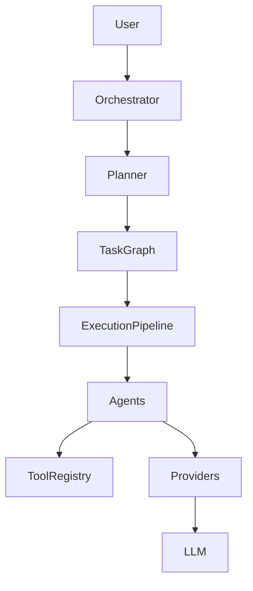

# Architecture Walkthrough

## Component Responsibilities

- **RuntimeBootstrap:** Composition root; initializes all dependencies via dependency injection.
- **RuntimeOrchestrator:** Coordinates workflow orchestration and lifecycle.
- **Planner:** Determines WHAT happens next (Task Graph generation).
- **ExecutionPipeline:** Executes middleware (Telemetry, Retry) for tasks.
- **Agents:** Perform domain logic; use tools.
- **Prompt Registry/Builder:** Format prompts for LLM providers.
- **Provider Abstractions:** Abstract external services (LLM, Search).

## Runtime Lifecycle
1. Request received.
2. `RuntimeBootstrap` resolves all components.
3. `RuntimeOrchestrator` is initialized.
4. `Planner` generates `WorkflowDefinition`.
5. `Orchestrator` executes the workflow using the `ExecutionPipeline` and `AgentRegistry`.
6. Telemetry captured at each stage.

## Diagrams

