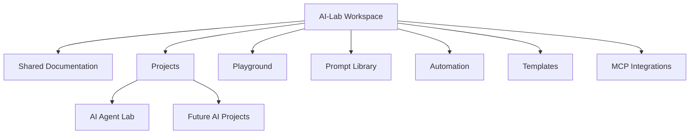

# AI-Lab

> **An AI Engineering Workspace for Designing, Building, and Scaling Production-Quality AI Systems**


---

## Vision

AI-Lab is my personal AI engineering workspace dedicated to designing, building, and evolving production-quality AI applications.

Unlike repositories that focus solely on prompt engineering or isolated AI experiments, AI-Lab emphasizes engineering discipline. Every project is developed with the same principles used in modern software engineering:

- Modular architecture
- Provider abstraction
- Multi-agent orchestration
- Observability
- Testing
- Documentation
- Maintainability
- Product thinking

The workspace serves as a long-term engineering environment for exploring modern AI systems while continuously improving software architecture and developer experience.

---

# Why AI-Lab Exists

Building production-ready AI software requires significantly more than integrating an LLM API.

Modern AI applications demand:

- Planning
- Orchestration
- Runtime management
- Context propagation
- Search integration
- Provider abstraction
- Structured outputs
- Logging
- Testing
- Documentation

AI-Lab exists to explore these engineering challenges through practical, production-oriented projects rather than isolated proofs of concept.

Every project inside this workspace is designed to answer a single question:

> **How should modern AI software be engineered?**

---

# Engineering Principles

Every project developed within AI-Lab follows a common engineering philosophy.

| Principle | Description |
|------------|-------------|
| Architecture First | Design before implementation |
| Modular Systems | Independent, replaceable components |
| Provider Agnostic | Avoid vendor lock-in |
| Documentation as Code | Documentation evolves with implementation |
| Observability | Runtime behavior should be transparent |
| Continuous Evolution | Improve incrementally through structured iterations |

---

# Workspace Organization

```
AI-Lab
│
├── README.md
├── docs/
├── Projects/
├── Playground/
├── Prompts/
├── Scripts/
├── Templates/
└── MCP/
```

Each folder has a specific responsibility.

| Folder | Purpose |
|---------|----------|
| docs | Shared engineering documentation |
| Projects | Independent AI applications |
| Playground | Experimental ideas and prototypes |
| Prompts | Reusable prompt library |
| Templates | Reusable project templates |
| Scripts | Automation utilities |
| MCP | Model Context Protocol integrations |

---

# Current Projects

| Project | Status | Description |
|----------|--------|-------------|
| AI Agent Lab | 🚧 Active | Production-oriented multi-agent AI runtime |
| Future Projects | 📋 Planned | AI products, MCP integrations, developer tooling |

Each project is independently versioned while sharing common engineering standards defined at the workspace level.

---

# Technology Stack

## Programming Languages

- Python
- Markdown
- PowerShell
- Bash

## AI Platforms

- Gemini
- Claude Code
- Groq
- OpenRouter

## Search

- Tavily

## Development

- Git
- GitHub
- VS Code
- Claude Code Router
- Pytest

Future additions may include FastAPI, Docker, Model Context Protocol (MCP), local LLMs, and cloud deployment tooling.

---

# Engineering Workflow

Every project follows a disciplined engineering lifecycle.

```text
Problem
    │
    ▼
Research
    │
    ▼
Architecture
    │
    ▼
Implementation
    │
    ▼
Testing
    │
    ▼
Documentation
    │
    ▼
Review
    │
    ▼
Release
```

Documentation is treated as part of the Definition of Done rather than an activity performed after implementation.

---

# Workspace Architecture



The workspace is intentionally organized around independent projects rather than a single monolithic codebase. This enables each project to evolve independently while benefiting from shared engineering standards, tooling, and documentation.
---

# Documentation

AI-Lab follows a layered documentation strategy designed to support both new users and experienced contributors.

## Workspace Documentation

The `docs/` directory contains documentation shared across every project in the workspace.

| Document | Purpose |
|----------|---------|
| Getting-Started.md | Workspace setup and onboarding |
| AI-Stack.md | Technologies used across AI-Lab |
| Development-Workflow.md | Engineering lifecycle and sprint process |
| Projects.md | Catalog of all workspace projects |
| Repository-Standards.md | Engineering and documentation standards |
| Release-Workflow.md | Versioning and release process |

Workspace documentation intentionally avoids project-specific implementation details.

---

## Project Documentation

Every project maintains its own documentation covering:

- Architecture
- Setup
- Runtime
- Roadmap
- Release history
- Engineering decisions
- Operational guidance

This separation ensures that workspace documentation remains stable while projects evolve independently.

---

# Documentation Philosophy

Documentation is treated as a core engineering artifact.

Every architectural decision should be documented.

Every release should update the documentation.

Every new feature should explain:

- Why it exists.
- How it works.
- How it can be extended.

Documentation should always describe the current implementation—not an aspirational future state.

---

# Engineering Standards

AI-Lab adopts engineering practices commonly found in production software teams.

## Architecture

Every significant capability should begin with architecture before implementation.

```
Problem

↓

Requirements

↓

Architecture

↓

Implementation

↓

Validation

↓

Documentation
```

---

## Code Quality

Projects are expected to emphasize:

- Readability
- Maintainability
- Simplicity
- Loose coupling
- High cohesion
- Clear interfaces

Whenever possible, complexity should be isolated rather than distributed throughout the codebase.

---

## Testing

Every project should include automated validation for critical functionality.

Testing should focus on:

- Business logic
- Runtime behavior
- Integration points
- Error handling
- Regression prevention

Testing is considered part of implementation rather than a post-development activity.

---

## Observability

Understanding AI execution is just as important as producing correct outputs.

Projects should expose:

- Runtime diagnostics
- Structured logging
- Provider information
- Execution timing
- Error context
- Verbose execution mode

Observability enables developers to understand system behavior rather than treating AI as a black box.

---

## Documentation

Documentation should evolve together with implementation.

Every release should update:

- README
- Architecture
- Setup Guide
- Roadmap
- Changelog

Documentation is never considered "finished"; it is continuously refined alongside the software.

---

# Repository Philosophy

AI-Lab is intentionally organized as a workspace rather than a single application.

This approach provides several advantages:

- Independent project lifecycles
- Shared engineering standards
- Common tooling
- Reusable templates
- Shared prompt libraries
- Centralized documentation

As additional AI projects are introduced, they naturally integrate into the existing workspace without disrupting established practices.

---

# Development Philosophy

The workspace follows an iterative engineering model.

Instead of attempting to build complete systems upfront, projects evolve through incremental milestones.

```
Idea

↓

Prototype

↓

Architecture

↓

Production Foundation

↓

Developer Experience

↓

Observability

↓

Scalability

↓

Production Readiness
```

This incremental approach encourages continuous improvement while minimizing unnecessary architectural rewrites.

---

# Current Focus

The primary focus of AI-Lab is the continued evolution of AI Agent Lab.

Recent engineering efforts have concentrated on:

- Multi-agent execution
- Runtime architecture
- Provider abstraction
- Structured report generation
- PDF generation
- Developer experience
- Documentation
- Production readiness

Future projects will build upon the reusable engineering patterns established by AI Agent Lab.

---

# Repository Roadmap

The long-term vision for AI-Lab extends beyond a single project.

## Phase 1

✅ Workspace Foundation

✅ AI Agent Lab

---

## Phase 2

- Shared AI libraries
- MCP experimentation
- AI product accelerators
- Developer tooling

---

## Phase 3

- Cloud-native AI services
- Plugin ecosystem
- Evaluation framework
- Shared runtime components
- Enterprise-ready reference implementations

The workspace is expected to continue growing as new AI engineering initiatives are added.

---

# Getting Started

Clone the repository:

```bash
git clone https://github.com/srikrishnaprasad-g/ai-lab.git
```

Navigate into the workspace:

```bash
cd ai-lab
```

Review the workspace documentation:

```
docs/
```

Explore the available projects:

```
Projects/
```

Each project contains its own README, setup guide, architecture documentation, and roadmap.

---

# Repository Navigation

If you're visiting AI-Lab for the first time, the recommended exploration path is:

1. Read this README.
2. Review the workspace documentation under `docs/`.
3. Explore the available projects.
4. Start with the project README.
5. Review the architecture documentation.
6. Follow the setup guide to run the project locally.
7. Explore the implementation.

This progression provides increasing levels of technical depth while minimizing the learning curve.
---

# AI Engineering Philosophy

AI-Lab is built on the belief that successful AI products require the same engineering discipline as any other production software system.

While Large Language Models have dramatically reduced the effort required to generate content, the surrounding engineering challenges remain:

- System design
- Component orchestration
- Runtime management
- Context handling
- Error recovery
- Observability
- Testing
- Security
- Developer experience
- Long-term maintainability

AI-Lab exists to explore these challenges through practical implementation rather than theoretical discussion.

Every project inside the workspace is expected to demonstrate not only what an AI model can accomplish, but also how AI systems should be engineered.

---

# AI Design Principles

## Modular by Default

Every major capability should exist as an independent component with clearly defined responsibilities.

Benefits include:

- Easier testing
- Better maintainability
- Improved scalability
- Lower coupling
- Faster feature development

---

## Provider Independence

No project should depend on a specific LLM vendor.

Instead, providers should remain interchangeable through a common abstraction layer.

Benefits include:

- Reduced vendor lock-in
- Easier benchmarking
- Lower migration effort
- Flexible experimentation
- Future extensibility

---

## Observability First

AI systems should never behave like black boxes.

Developers should understand:

- what happened
- why it happened
- how long it took
- which provider was used
- what failed
- where execution stopped

Observability should be designed into the system rather than added later.

---

## Structured Outputs

AI-generated content should be transformed into structured artifacts whenever practical.

Examples include:

- Executive summaries
- Key findings
- Tables
- Reports
- PDFs
- JSON
- Markdown

Structured outputs simplify downstream automation while improving consistency.

---

## Documentation as an Engineering Discipline

Documentation is not written after implementation.

It evolves together with the software.

Every architectural change should be reflected in the documentation.

Every release should synchronize:

- Code
- Tests
- Documentation
- Release Notes
- Changelog

This ensures the repository remains understandable as it evolves.

---

# Workspace Best Practices

Projects inside AI-Lab are encouraged to follow a consistent engineering workflow.

## Before Development

- Understand the problem
- Capture requirements
- Design the architecture
- Identify extension points
- Define validation criteria

---

## During Development

- Keep components modular
- Prefer composition over complexity
- Write meaningful logs
- Update documentation
- Validate continuously

---

## Before Release

Every release should include:

- Completed implementation
- Automated validation
- Documentation updates
- Changelog
- Release notes
- Version tag

---

# Collaboration Principles

Although AI-Lab currently serves as a personal engineering workspace, it is intentionally organized to support future collaboration.

Contributors are encouraged to:

- Maintain modular designs
- Keep documentation synchronized
- Write readable code
- Follow repository standards
- Preserve architectural consistency
- Add tests for significant functionality

Engineering decisions should prioritize long-term maintainability over short-term convenience.

---

# Quality Standards

Every project should strive for excellence in the following areas.

| Area | Objective |
|------|-----------|
| Architecture | Clear separation of responsibilities |
| Code | Readable, maintainable implementation |
| Testing | Reliable automated validation |
| Documentation | Accurate, current, comprehensive |
| Developer Experience | Intuitive tooling and workflows |
| Observability | Transparent runtime behavior |

These quality standards apply across every project within the workspace.

---

# Future Vision

AI-Lab is intended to evolve into a comprehensive AI engineering ecosystem.

Future initiatives may include:

- AI product accelerators
- Shared runtime libraries
- Model Context Protocol integrations
- Agent evaluation frameworks
- AI benchmarking utilities
- Developer productivity tools
- Cloud-native AI services
- Enterprise reference architectures

Every new initiative will build upon the engineering patterns established by existing projects.

---

# Workspace Governance

To maintain consistency as the workspace grows, every project should adhere to the following expectations:

- Maintain a project README.
- Document architectural decisions.
- Provide setup instructions.
- Track release history.
- Maintain a roadmap.
- Keep documentation synchronized with implementation.
- Follow workspace engineering standards.

Governance ensures that projects remain consistent while allowing individual teams or contributors flexibility in implementation.

---

# Frequently Asked Questions

## Why organize AI-Lab as a workspace?

A workspace allows multiple independent AI projects to coexist while sharing engineering standards, tooling, documentation, and reusable assets.

---

## Why separate workspace documentation from project documentation?

Workspace documentation describes shared practices and tooling.

Project documentation explains implementation-specific details.

This separation minimizes duplication and keeps documentation easier to maintain.

---

## Why emphasize architecture so heavily?

Good AI software depends on more than model quality.

Architecture determines how systems evolve, scale, integrate, and remain maintainable over time.

---

## Why treat documentation as code?

Documentation becomes outdated quickly unless it evolves alongside implementation.

Treating documentation as an engineering artifact ensures long-term accuracy and usefulness.

---

# Additional Resources

Project-specific documentation is available within each project directory.

For AI Agent Lab, refer to:

- README.md
- SETUP.md
- CHANGELOG.md
- docs/ARCHITECTURE.md
- docs/CLI.md
- docs/PROVIDERS.md
- docs/OBSERVABILITY.md
- docs/ROADMAP.md
- docs/CONTRIBUTING.md
- docs/RELEASE_PROCESS.md

As the workspace expands, each project will provide a comparable documentation experience.
---

# Workspace Evolution

AI-Lab is designed to evolve incrementally, with each milestone building on a stronger engineering foundation.

```text
Experimentation
        │
        ▼
Repository Foundation
        │
        ▼
AI Agent Lab
        │
        ▼
Multi-Agent Runtime
        │
        ▼
Provider Abstraction
        │
        ▼
Developer Experience
        │
        ▼
Observability
        │
        ▼
Production Readiness
        │
        ▼
Reusable AI Components
        │
        ▼
Shared AI Platform
```

Rather than pursuing a large, monolithic implementation, the workspace embraces continuous evolution through well-defined milestones, regular refactoring, and disciplined documentation.

---

# Release Philosophy

Every project within AI-Lab follows a structured release process.

A release is considered complete only when the following artifacts are updated together:

- ✅ Implementation
- ✅ Automated tests
- ✅ Documentation
- ✅ Changelog
- ✅ Version tags
- ✅ Release notes

This ensures that the repository remains coherent, reproducible, and maintainable over time.

---

# Repository Standards

Across every project in AI-Lab, the following standards apply:

| Category | Standard |
|----------|----------|
| Version Control | Git with feature branches and descriptive commits |
| Documentation | Markdown, version controlled, reviewed alongside code |
| Architecture | Modular, loosely coupled, extensible |
| Testing | Automated validation for production features |
| Logging | Structured logging with configurable verbosity |
| Dependencies | Minimal, explicit, and documented |
| Code Reviews | Changes should preserve architectural consistency |

These standards are intended to promote long-term maintainability rather than short-term development speed.

---

# Learning Objectives

AI-Lab is also a continuous learning environment.

The workspace is used to explore and practice modern software engineering topics including:

- Multi-agent systems
- AI application architecture
- Retrieval-Augmented Generation (RAG)
- Prompt engineering
- Model Context Protocol (MCP)
- LLM provider integrations
- AI observability
- Runtime orchestration
- API design
- Developer tooling
- Product thinking for AI systems

Each completed project serves both as a working application and as a reference implementation for future work.

---

# Acknowledgements

AI-Lab benefits from the rapidly evolving open-source AI ecosystem and the broader software engineering community.

Special appreciation goes to the creators and maintainers of the tools and platforms that make experimentation and learning possible, including:

- Python
- Git
- GitHub
- Visual Studio Code
- Claude Code
- Claude Code Router
- Gemini
- Groq
- OpenRouter
- Tavily
- Pytest

Their contributions enable developers worldwide to build increasingly capable AI systems.

---

# Contributing

Although AI-Lab is currently maintained as a personal engineering workspace, contributions, discussions, ideas, and constructive feedback are always welcome.

When contributing:

1. Follow the repository standards.
2. Preserve architectural consistency.
3. Keep documentation synchronized with implementation.
4. Include appropriate tests for significant functionality.
5. Favor readability and maintainability over clever solutions.

Refer to each project's `CONTRIBUTING.md` for project-specific contribution guidelines.

---

# License

Unless otherwise stated, projects within this workspace are released under the MIT License.

See the corresponding `LICENSE` file within each project for details.

---

# Contact

Questions, suggestions, or discussions about the projects in this workspace are welcome through GitHub Issues and Discussions.

As the workspace grows, additional documentation, examples, and reference implementations will continue to be added.

---

# Workspace Status

| Area | Status |
|------|--------|
| Repository Foundation | ✅ Complete |
| Documentation Framework | ✅ Complete |
| AI Agent Lab | 🚧 In Active Development |
| Shared Engineering Standards | ✅ Established |
| Multi-Project Workspace | 🚧 Expanding |
| Future AI Projects | 📋 Planned |

---

## Next Steps

If you're new to AI-Lab, the recommended journey is:

1. Explore the workspace documentation in `docs/`.
2. Choose a project from the `Projects/` directory.
3. Read the project's `README.md`.
4. Review the architecture documentation.
5. Follow the setup guide to run the project locally.
6. Explore the implementation and experiments.
7. Track future releases and enhancements through the roadmap and changelog.

Happy building!